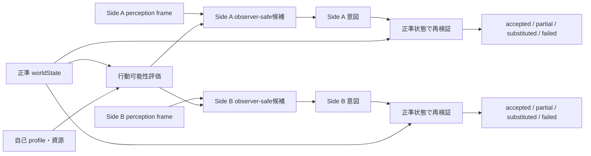

# Observer-safe 行動可能性と正準再検証

作成日: 2026-08-05
対象: `BL-030`, `BL-031`, `T_ACTIONS`
実装: `packages/shared/src/action-feasibility.ts`

## 責務境界

候補生成は、正準世界をそのままキャラへ開示する処理ではない。worldStateはサーバー内で
可否判定にだけ使い、キャラ入力には成立候補とobserver-localな対象ラベルだけを渡す。

## 入出力

| データ | 所有者 | 用途 | キャラへの開示 |
|---|---|---|---|
| action constraints | キャラprofile | reach、視線、移動、発話、保持物要件 | 自分の成立済み候補として間接開示 |
| worldState | サーバー | actor、場面、object、pairの正準可否 | 全量非開示 |
| perception frame | observer別projection | 対象を現在局在できるか、表示ラベル | 対応Sideだけ |
| availableActions | サーバー | character agentが選べる閉じた集合 | 対応Sideだけ |
| resolution | サーバー | 実行時再検証の監査事実 | turn recordへ保存。内部理由をそのまま公開文にしない |

対象actionはcounterpart accessが`coarse`または`clear`のときだけ候補になる。正準対象が
存在していてもobserverが局在できなければ、暗黙にその正準対象へ命中させる候補は渡さない。
self actionは相手情報を必要としない。

## 再検証と代替

候補選択後に資源、距離、拘束、agency、対象、保持物等が変わり得るため、engineは実行時に
同じ規則を再度評価する。必殺強化だけが失効して通常skill本体が成立する場合は`partial`、
選択自体が不成立でもactorが行動可能なら、相手状態を読まない休息・防御・待機から
`substituted`を選ぶ。actor自身が不在・無意識・非self-directedなら`failed`とする。

このタスクでは物体や場面が生む効果量・world transitionは決定しない。それらは
`T_CAUSALITY`、複数bucket間での再検証時点と同時mergeは`T_TIMELINE`が担当する。
