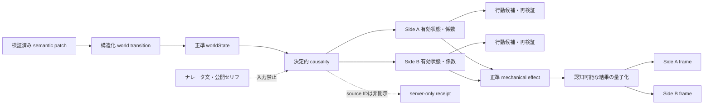

# バトルの構造化因果と自覚・無自覚な影響

作成日: 2026-08-05
対象: `BL-040`, `BL-041`, `T_CAUSALITY`
実装: `packages/shared/src/battle-causality.ts`, `packages/shared/src/battle-world.ts`

## 永続 consequence provenance

新規turn recordは加算的な`consequenceReceipts`を保持する。識別可能なevent、parameter
delta、semantic operation、world operationには、次のtagged sourceを必ず1つ割り当てる。

- `action`: 検証・解決済みのキャラクター行動
- `scheduled_effect`: bounded effect instance（遅延effect実装sliceで利用予定）
- `system_rules`: turn-start、turn-resolution、terminal rule
- `environment_world`: 検証済みsemanticまたはcanonical world transition

linkは構造化ID、対象、parameter key、operation indexのみから構成し、event summaryや
narrationから原因を推測しない。legacy turn recordはreceiptなしで読み取れる。本receiptが
保証するreplayは将来のpending-effect schedule純粋再解決に限定し、full semantic replayや
full-turn replayは対象外とする。

## Bounded pending effect lifecycle

`pendingEffects`は戦闘内で最大32件に制限し、任意scriptや自然言語predicateを保存しない。
初期実装が受け付けるtriggerは、指定turn到達と対象HPのserver-defined比率判定だけである。
payloadは既存2戦闘者へのbounded parameter deltaに限定する。各effectはstable ID、作成turn、
期限、発生元、任意のsource incapacitation取消、公開時点を持つ。

turn開始のpre-action境界でpure schedulerを実行し、結果と残存scheduleをengine continuationへ
固定する。retryはそのcontinuationから再開するため、同じeffectを再発火しない。発火・取消・
失効eventは`sourceEffectId`を持ち、発火deltaは`scheduled_effect` receiptへ結び付く。
公開DTOは明示的に`public_when_scheduled`とされたeffectだけを、raw deltaを除いて投影する。

## 責務境界

因果計算はサーバー内の純粋関数で行う。ナレータ、公開セリフ、キャラの推測、任意の
`semanticState.facts` は入力にしない。原因entity IDは監査用のserver-only receiptであり、
行動候補、イベント文、キャラframe、公開DTOへ自動転記しない。

## 因果入力と作用

| 構造化入力 | 適用対象 | 正準な作用 |
|---|---|---|
| actorの意識・移動・拘束・姿勢・感覚・精神・agency | 当該actor | 行動可否、与ダメージ、回復、実効速度の係数 |
| areaの照明・騒音・空間・移動制約 | area内actor | 有効視覚・聴覚・移動状態、空間係数 |
| held/worn/attached object/effect | holder/wearer/anchor | cover、視覚・聴覚・移動作用 |
| scene配置のterrain/effect | 同一area内actor | 視覚・聴覚・移動作用 |
| pair relationとpresence | actorと対象 | 対象集合、距離、視線、実行可否 |

複数の阻害は有限値の強い側へ合成する。coverは`none < partial < full`、感覚作用は
`none < impair < block`、移動作用は`none < hinder < immobilize`である。係数は既存の
安全範囲へclampし、Side名ではなくactor/targetの関係から計算する。

scene上の一般objectを自動的に全員の遮蔽とはみなさない。局所的な遮蔽・拘束・目隠しは
対象へheld/worn/attachedで結び、area全体への作用はterrainまたはeffectとして構造化する。
これにより「壁がある」という文章だけで全員を拘束するような自然文推測を避ける。

## world transition

検証済みsemantic patchのうち、次だけを機械worldへ同期する。

- scene/held/attached/absentのlocation
- active tombstone
- 構造化されたentity追加
- character area変更に伴うA/B pair relation

必要なarea追加、携行化、placement、pair更新を一つの`BattleWorldTransition`へまとめ、
base revision、turn、確定event ID、参照・循環・件数上限を既存transition validatorで
再検証する。semantic適用後の変換またはworld適用が失敗した場合は、semantic/worldの
どちらも新revisionへ進めない。labelやfactsの自然文はtransitionへ移さない。

## 自覚と無自覚

原因を認知できるかどうかと、原因が正準結果へ作用するかどうかを分離する。

1. 正準worldStateに存在する影響は、observerの知識に関係なく可否・係数へ作用する。
2. 正準効果は通常どおりmechanical evidenceへ記録し、定量値を粗い変化へ量子化する。
3. observerは自分が関与した、またはsensory accessを持つ結果だけを受け取る。
4. hidden sourceのID・label・位置はframeへ入れない。
5. 原因帰属が必要なら、確定eventに結び付いた検証済みsensory evidenceを別途用いる。

したがってキャラは「攻撃の効きが弱かった」等の知覚可能な結果を得られても、見えていない
防護entityの正体を自動的には得ない。後に原因を目撃・同定した場合だけ、その時点のframeへ
認知可能な事実として現れる。

## 後続タスクとの境界

このタスクは因果入力、行動可否、Side別係数、semanticからのworld transition、非漏えいを
担当する。どのsnapshotから双方を計算するか、同速帯の原子的merge、速度差による先後、
相討ち、排他的object競合は`T_TIMELINE`が担当する。現在のA先行処理はこのタスクでは変更しない。
