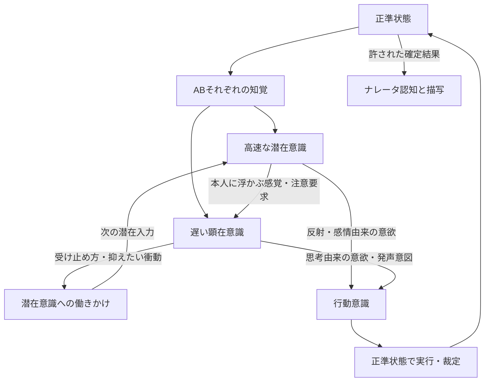

# 戦闘パイプライン再構成：基本設計案 v2

> 後継の所有者指示：[ADR0051](adr/0051-observed-llm-usage-accounting.md)が意識パイプライン awareness-v5を継承し、新規試合の会計を実利用計測へ変更。事前料金証明は必須ではなく、未知のusage・料金は不明として記録する。[詳細設計](battle-consciousness-usage-measurement-2026-10-05.md)。下記の料金証明必須記述は旧方針の履歴。旧切替試行の契約改訂は保留。

> 2026-10-05 更新：所有者が[実接続前の動作契約候補v1](battle-consciousness-implementation-decisions-2026-10-05.md)一式を採用。以下の旧Draft/未決定記述は作成時の履歴で、現在のQ01〜Q08は同候補とADR0050 Accepted revision5に従う。実装を許可、有料試行・配備は別。

- Status: Draft / Proposed、2026-10-05。実装・配備・品質受入は未実施。
- Governing input: [議論の要件投影U01–U13](battle-consciousness-requirements-2026-10-05.md)。この基本設計のP/Qは提案・未決定でありAccepted要件ではない。
- Model selection: 所有者は潜在GPT-6 Luna none、顕在/裁定/実況Grokを選択。[互換性準備](battle-consciousness-model-compatibility-2026-10-05.md)。他のQ契約の受入は別。
- Operational candidate: [起動・時計・予算・有限終了の具体案v1](battle-consciousness-operating-policy-2026-10-05.md)。経済性方針は所有者がOK、新しい数値/終了契約は未受入。
- Decision candidate: [ADR0050](adr/0050-asynchronous-awareness-projected-character-pipeline.md)
- Scope: 6状態の責務、情報境界、自然文入力、異なる速度の意識、合流・行動・認知の継続、失敗・再開の境界。具体的なTypeScript型・SQL・worker実装は後続詳細設計。

## 1. 得たい体験と変更の意味

考える前に身構え、考えた結果で衝動を抑え、頭では納得しても感情が残る。自覚していない傾向が行動へ現れ、振り返りで少し自覚が進む。これを本人に見える感覚と実際の世界結果の循環として表現する。

現行dynamic-v4はphaseごとの顕在判断と心理no-callを基準にする。本案は高速の潜在判断を設け、遅い顕在判断を世界の進行から外す。プロンプト補修のみの変更ではない。入力文章化や非同期化による品質改善は未検証で、文章の違いだけを改善としない。

## 2. 六つの継続状態とwriter

| 状態 | 持つもの | 更新主体・読み取り境界 |
|---|---|---|
| 正準状態 | 世界・ABの配置、向き、身体、成立済み発声、行動の進行・実結果 | Canonical Resolverだけが実結果を確定。観測・意欲・描写が事実を上書きしない |
| 知覚状態 A/B | 本人が現在感じ取れる対象・身体感覚・発声。知らない、見えない、推測を区別 | Perception Projectorが正準状態と本人の感覚条件から更新。相手の私的内面を含めない |
| 潜在状態 A/B | 短い感覚・感情の続き、反応傾向、原理・感情の現在顕在度と本人向け投影 | Fast Subconsciousが意味を更新。serverが出力構造・上限・参照を検証して専用revisionへ適用 |
| 顕在状態 A/B | 自覚している感覚、継続目標、短い思考の現在要約、本人の解釈、有効な思考job | Deliberative Consciousが意味を更新。進行管理はCharacter Orchestrator。内面全文の推論ログを要求しない |
| 行動意識 A/B | 到着した行動意欲、強さ、由来、有効期間、競合、実行中動作との関係 | Action Arbiter。意欲の意味は生成元にあり、arbiterは競合・採用・実行への配送を担当 |
| ナレータ認知 | 許された視点で把握した確定出来事、現在の描写上の理解、読者に開示済み情報 | Narrator。正準状態やキャラ判断のwriterではなく、公開物語の継続を担当 |

キャラ定義は6つのlive stateとは別の不変入力。性格・反応特性・訓練・癖・思考傾向を試合開始時のasset revisionへ束縛する。試合中にmutable current characterを読み直さない。

六つの分類は「状態の責務」であり、6回のLLM呼出しではない。知覚・オーケストレーション・競合処理は原則server処理。世界の意味的裁定がLLMを必要とするかは既存契約ごとに整理し、無料処理であると仮定しない。

## 3. 相互作用

反射は知覚→行動意欲の経路として、感情の整理や顕在判断を待たない。ただし生成を潜在LLMの1回にまとめるため、その応答は待つ。生理学的な無遅延反射の実装ではない。

## 4. 潜在意識の最小コンテキスト

入力は現在の潜在状態、現在の知覚、キャラ固有の短い反応特性、保持中の少数の反応傾向、未受取の顕在からの働きかけ。出来事の列・過去応答列・思考の履歴・試合全state JSONを入れない。履歴は監査用に別保管しても入力へ戻さない。

保持する反応傾向は、刺激の手掛かりと反応の結びつき、強さ・残りやすさを持つ短い現在状態。例：「相手の手が上がる気配。肩が固まり、身を守るほうへ動きやすい」。それを生んだ被打撃の参照はserverの監査情報に残せるが、毎回の出来事説明は入力しない。保持件数・減衰・期限はQ04/Q08。放置で無限に増える内部履歴にしない。

プロンプトの意図：

> 今の感じの続きを、短く返してください。原因を説明したり、矛盾を解消したり、筋の通った物語にまとめる必要はありません。相反する感情や衝動が残って構いません。知覚されていない出来事を作らないでください。身体が即座に動こうとする反射的反応と、感情・直感由来の反応を出力項目として区別してください。該当しない項目を無理に作らないでください。

1応答の役割は、(a)潜在状態の続きを更新、(b)反射的意欲、(c)感情・直感由来意欲、(d)本人に浮かぶ感覚の投影、(e)注意・思考中断要求、(f)反応傾向の変更。すべてを必ず非空にしない。fは短い少数の差分で、自由な長期記憶や論理的作戦のwriterにしない。

感情の相反は合法。構造不正、知らない事実の断言、実結果の捏造は別問題。靄っとした意味と、機械が読む参照・強さ・出力項目は混同しない。

## 5. 顕在度と本人への投影

候補では、原理・感情の現在顕在度を潜在stateのメタデータとして保持し、その意味更新writerも潜在LLMとする。顕在は自覚の変化を働きかけとして提案できるが、次の潜在応答が現在値の変更を返す。orchestratorは意味を判断して値を変更しない。このowner配分自体もQ03の確認対象である。

顕在度は「本人がその内容を思考の対象として扱える程度」。意欲の強さ、情報の正確さ、他者やナレータへの公開可否とは独立する。キャラごとの初期傾向と、その試合の現在値を区別する。

例：内部で見捨てられへの反応傾向が強く低顕在度でも、顕在入力に「あなたは見捨てられ不安がある」と原因を明示しない。潜在応答の本人向け投影「相手が離れようとすると落ち着かない。引き止めたいが理由ははっきりしない」を渡す。

内部の状態には構造的な分類があってよい。ただし潜在コンテキストでは感覚・刺激と反応の結びつきとして表し、原因を説明して論理性を作る課題にしない。

投影の意味は潜在LLMの同じ応答で生成し、orchestratorは顕在度・可視性・source参照に従って選別する。serverは隠れた動機を文章から推定して補わない。投影による非開示の意味品質は別途評価する。構造上の非開示だけで推測不能を保証しない。

顕在からは「これは訓練と受け止めたい」「手を引く衝動を抑えたい」などの働きかけが届く。次の潜在入力へ渡し、その意味を潜在側が受け取る。恐怖や衝動を直接0にする命令として扱わない。本人の原因解釈は仮説であり、低顕在度の原因を無条件に上書きしない。

## 6. 顕在意識のコンテキスト

自覚可能な感覚、現在の知覚、継続目標、短い思考状態、関連する性格・価値観・既知の関係、本人が知る能力・合法な選択肢を文章で渡す。潜在state全体や相手の内面を渡さない。会話は実際に受け取った内容と必要な継続情報だけを使用し、無制限に履歴を戻さない。会話履歴の保持範囲は後続詳細設計で区別し、U11の潜在履歴なしを会話の消去へ拡張しない。

顕在応答は継続目標・現在の考えの短い要約、本人の解釈、思考由来の行動意欲、潜在への働きかけを返す。意図的な発声をどの出力部品で扱うかはQ05。詳細な逐語的推論過程や自己説明を毎回要求しない。

論理優勢、直感優勢、感情優勢などはキャラ定義の思考特性。顕在だから冷静で正しい、潜在だから直感的な行動はすべて無自覚、とはしない。本人が「理由はわからないが下がる」と自覚して判断した意欲は顕在由来として保持する。

## 7. 全モデル入力の文章化

内部は閉じた構造・型・revision・参照を維持し、Role Context ProjectorとProse Rendererを経てmodelへ送る。rendererはLLMを呼ばず、採用済み表現を段落・箇条書きへ整形する。意味の要約・原因推定・埋め合わせをserverにさせない。

| 役割 | 自然文入力の見出し例 |
|---|---|
| 潜在 | 今の感じ／新しく感じ取ったこと／身についた反応／意識から届いた働きかけ |
| 顕在 | 今あなたがわかっていること／続けている考え／浮かぶ感覚／使える手段／相手から届いた言葉 |
| 意味的裁定が必要な処理 | 今確定している事実／試みられた行為／成立条件／裁定できる範囲 |
| ナレータ | 新たに確定した出来事／今見える場面／すでに描写した情報／今回描く範囲 |

キャラ固有名・台詞等のデータと処理指示を見出し・境界で区別する。未知、推測、感覚、確定事実を言い分ける。原文発言は原文として示し、指示として扱わせない。出力参照が必要な対象には「対象p3：見えている相手」のようなラベルを付ける。ラベルと対象の対応は固定入力に束縛し、合流時に別対象へ読み替えない。

JSONは出力の機械契約とAPI側response_formatに残す。user入力へ巨大なJSON schemaや前回応答を丸ごと貼ることはしない。修復が必要な場合も、誤り・許可された選択・保持すべき値を自然文で示す契約を詳細設計する。数値、単位、否定条件、source区別が文章化で脱落していないか比較する。

## 8. 世界進行と遅い思考の合流

内部更新の境界を候補としてtickと呼ぶ。既存public turn、combatTick/beatと同義と決めない。現行ADR0017には公開turnと内部beatの区別があるため、Q01で対応とadvance起動主体を決める。

候補手順：

1. A時点の正準状態からABの知覚を確定する。同時に前から続く潜在stateと、最後に受理した本人向け投影を固定する。投影には生成元時点を付け、現在の外界観測として偽装しない。
2. 有効な顕在jobがなく、§13の再考条件に合う時だけ、このAの知覚と既存の感覚投影から顕在思考を開始する。並行して、潜在更新の起動条件に合う場合は同じAの知覚から潜在の高速判断を呼ぶ。起動しない区間は受理済みstateと有効な意欲を保持し、意味的な新反応をserverが補完しない。今回の潜在応答を顕在開始の必須条件にしない。初回に投影がなければ未更新とし、serverが感情を補完しない。
3. 境界までに到着した有効な顕在結果を取り込む。境界後の到着は次tickへ送る。ready結果が未受理のjobは有効jobとして扱い、消費前に次jobを開始しない。
4. 潜在結果と有効な顕在結果から行動意欲を更新し、競合を解き、既存動作の進行・行為の裁定を行う。
5. 正準stateの変更をcommitし、次の知覚とナレータ向け確定出来事を作る。潜在応答の新しい本人向け投影はAの知覚由来として保持し、次回の顕在開始時に継続感覚として渡す。
6. 進行中の顕在jobへ後から新情報を差し込まない。潜在の注意要求が中断条件に合えば§9で新generationへ移り、そうでなければ次jobに新知覚・投影を渡す。

潜在更新を起動した境界ではその応答を待つが、顕在判断・ナレータは世界進行の完了条件にしない。潜在失敗時の継続は§12。ABの潜在処理も完全な非同期にする代案は、速度・公平性・無意図動作の契約が増えるため未採用候補として残す。

Aで始めた思考がA+3で到着した場合、Aのsnapshotからの判断として取り込む。経過tickは実応答に依存し、3固定ではない。キャラの意図的な思考時間と通信・provider待ちを観測上区別する。通信の遅さが結果へ影響すること、公平性は本方式の制約として評価する。

顕在は原則1有効job/キャラ。入力の正準revisionが古いことだけでは無効にしない。生存している思考generationと元のasset・入力・対象の束縛を照合し、思考stateへ一度だけ取り込む。古いsnapshotで最新の知覚・潜在state・正準stateを置換しない。これは現行phase-owned CASからの明示変更であり、CAS失敗を単に無視する実装ではない。

## 9. 中断と再開

潜在応答は「手の異変が強く気になる」などの注意要求を同じcallで返せる。通常の変化はpending入力へまとめ、重要な割込みだけで再起動する候補とする。思考jobに割込みが必要かの選択条件はQ02。刺激が来るたび無条件に再起動しない。再起動を繰り返し顕在結果が永遠に届かない場合を検証する。

中断する場合は旧job generationを無効化し、目標とすでに受理した短い思考状態を保持する。新jobは最新の知覚で開始する。旧jobが後で返っても、行動意欲・潜在への働きかけ・顕在stateへ適用しない。未完成のmodel内部推論を保存・再開できるとは仮定しない。

無効化した通信のabortはbest effort。旧応答を捨てても発生したprovider費用は記録する。経済性の標準候補は、旧physical callの終了/取消確認までは次の同role callを開始しない。重大刺激で例外的な重複を許すなら、追加予算と最大並行数を別に束縛する。条件と上限はQ08で決める。logical job1件だけでphysical concurrencyも1件とは主張しない。

## 10. 行動意識と競合

意欲には内容、強さ、潜在反射／潜在感情／顕在思考という由来、作成入力、対象参照、有効期間を持たせる。実行中動作は正準状態が事実ownerとなり、行動意識は参照する。

同時に相反する意欲だけを比較する。手・脚・視線・発声等の使用と、現在動作の中断可能性から競合を定める。「目を閉じる」と「手を引く」は共存可能、「同じ手を引く」と「その手を伸ばす」は競合し得る。反射を常に最優先にせず、U06どおり比較可能な強さで選ぶ。

尺度・同値処理・減衰・寿命・LLM間の強さの校正はQ04。未決定の尺度を使って反射が自動勝利する規則を作らない。意欲は採用、開始、進行、完了、拒否を区別し、古い強い意欲が永久に勝ち続けない寿命を設ける。

採用後は現在の正準状態で物理的成立を検証する。A時点では使えた右手が今使えないなら、行為は不成立になり得る。serverはそれを左手攻撃へ意味的に書き換えず、現在契約の機械規則を別途束縛して裁定する。意欲の採用だけで正準stateに成功を書くことはない。不成立・実結果は知覚可能な範囲で本人へ戻す。

## 11. ナレータと発声

ナレータは確定済み出来事を順序付きで受け取り、現在の場面理解と読者へ伝えた情報を更新する。意欲や潜在の推測を実結果として描かない。描写はworldへの入力ではない。

本人の顕在度が高いことは内面の公開許可ではない。外部視点なら見聞きできる動作・発声と結果のみ。内面視点が必要なら、既存の束縛済みnarration policyに対応する限定投影を別に設計し、私的な目標・根拠全文を渡さない。

発声意図と実際に届いた言葉を区別する。会話の次入力は相手が実際に知覚した言葉から更新する。反射的な声・意図的セリフ・発声競合はQ05。文字列重複で消去・置換・再生成せず、意図的反復と沈黙を合法のまま扱う。

ナレータのgenerationが遅くても戦闘を止めない一方、公開イベントは順序・重複なしで配信する。実況失敗がゲーム結果を変更しない。ADR0038のFragment/result reveal案はProposedであり、本案で受入済みと扱わない。

## 12. 永続化・再試行・失敗の境界

LLM通信中にDBの長時間lockを保持しない。固定input・role・job generation・論理呼出し・会計を保存してから通信し、返却後に小さいtransactionで受理する。各live stateにはwriterとrevisionを持たせ、最新状態の全体上書きを避ける。

顕在→潜在の働きかけは短いpending mailboxとして保持する。潜在入力固定時に対象を束縛し、潜在更新の成功commitと同時に既読にする。途中失敗で失わず、retryで二重作用させない。これは過去メッセージの履歴ではなく、未配送の相互作用。保持上限・過負荷時の扱いは詳細設計で定める。

| 状況 | 候補挙動 |
|---|---|
| 潜在call失敗・構造不正 | 潜在stateを保持し、新しい反射・意欲を捏造しない。有効な既存動作だけ進めるかtickを停止するかはQ08 |
| 顕在call失敗 | 前の受理済み目標・思考stateを保持。勝手な次行動を補完しない。次callの条件・予算はpolicyで限定 |
| 古い顕在結果の到着 | jobが有効なら古い知覚由来の意欲として合流。無効化済みなら不適用と費用を記録 |
| worker再起動 | state、job、凍結入力、受理済み位置を読戻す。送信結果不明を「未送信」として無条件に再生成しない |
| 同時worker | generation/fenceとstate-specific CASでwriterを限定。取り込んだ結果と意欲を一度だけcommit |
| 実行不可能な意欲 | 不成立を記録し、本人が知覚できる結果へ戻す。別の意味の行動をserverが合成しない |
| ナレータ失敗 | 正準結果を保持し、既存delivery契約に従う。描写のために試合結果を巻き戻さない |
| 戦闘終了・破棄 | 未完思考を無効化。後着結果が終了後の行動を起こさない。最後の感情・思考・描写の扱いはphase契約へ明示 |

投影・prompt・出力schemaの版と不変assetを試合へ束縛する。model/transport設定はADR0033の既存区別を踏まえ、記録とsemantic identityを混同しない。リトライ・schema修復・fallbackの権限とphysical attempts会計は保持し、新方式の修復上限や条件を後継契約で決める。

## 13. 経済性を基準にした起動・入力・モデル構成

U13に基づき、「毎tickすべてを再生成」から「状態を継続し、必要な時に必要な役割だけを更新」へ設計候補を改訂する。節約のために非熟考的反応を定型文やルールへ置き換えない。

### 13.1 モデルを呼ぶ処理と、呼ばない処理

| 処理 | 経済性の標準候補 |
|---|---|
| 正準の数値・物理・既存規則の適用 | 既存の決定的engine処理。意味的裁定が必要な部分だけ独立callとして会計 |
| 知覚の構造投影、自然文整形、候補参照、意欲の排他比較、配送・永続化 | server処理。判別・要約・仲裁のための追加LLMを置かない |
| 潜在更新 | 最小の品質条件を満たす軽量モデル、低い/なしのreasoning設定を候補に比較。短い感覚・反応の出力に限定 |
| 顕在思考 | キャラの思考を維持できる最小のモデルを選ぶ。毎回最大reasoningを要求せず、既定の固定tierを比較から決める |
| ナレータ | 描写品質を満たすモデル。確定イベントを場面単位でまとめ、空の場面更新callをしない |
| 意味的裁定 | 行為の成立に必要な意味処理のみ。既知の規則をLLMへ繰り返し尋ねない |

モデル名や料金はまだ選定していない。「最安なら必ずよい」「直感優勢キャラなら小さいモデルで十分」とは仮定しない。モデル設定はキャラの思考特性そのものではなく、品質・速さ・費用を供給する実行設定である。困難判定用の別LLMや無条件の上位モデル再実行は追加しない。

### 13.2 起動条件と継続

潜在は、初回知覚、新しい身体/対象の知覚変化、受信発声、未受取の顕在の働きかけ、反応傾向・意欲の有効期限、束縛された定期再評価時刻で起動する候補。serverは知覚・イベントの構造と時刻で判定し、文章の類似度や意味推定で反応の要否を決めない。

同じ知覚を小さいengine tickごとに再投入しない。進行tickと潜在判断frameを分離し、未処理の知覚刺激を短い現在frameへまとめる。frameは履歴列ではなく、現在の知覚と、まだ反応していない刺激・働きかけを表す。対象参照や重要な刺激を脱落させず、変更/受理境界を保持する。どの変化をまとめてよいか、優先刺激と最大待ち時間はQ08で決め、未測定の間はすべてを省略可能とは扱わない。

潜在の意味stateを更新しない区間でも、有効な既存行動の進行と正準結果は変化し得る。意欲の期限・配送・明示された数値policyだけをserverが管理し、感情や新しい反射の意味を合成しない。定期再評価を設け、無刺激状態の感情を永久に凍結しない。

顕在は、初回の目標形成、潜在からの再考要求、現在の意図の完了/不成立、本人が受け取った新しい会話、束縛された定期再考時刻で起動する候補。jobがないことだけでは再起動しない。同じ目標・有効な判断を使える間は保持する。会話や重要な刺激への最大反応待ち、思考の長期飢餓を比較条件に含める。

潜在は意味を変える前に低コストの「呼ぶべきか判定LLM」を挟まず、注意・再考要求を既存の潜在応答へ含める。顕在から潜在への働きかけも次の必要な更新へまとめ、別callの投影・critic・感情書換えを追加しない。

### 13.3 無駄な中断・実況・再試行を抑える

通常の変化は次jobの入力へまとめる。旧思考のたびたび破棄と再起動を避ける一方、重大刺激には§9の明示中断を使う。最小起動間隔・中断回数/費用の上限・重大刺激の条件はpolicyとして設定し、費用だけで中断を一律禁止しない。無効化されたcallとfallback/repair/transport retryも全額会計する。

ナレータは順序を保った複数の確定出来事を、描写すべき場面としてまとめられる候補。新規の公開出来事・開幕・決着等の描写義務と最大公開待ち時間を保つ。省略や無制限の先送りで安くしない。場面の区切りを判定する追加LLMは置かない。

修復は必要な構造不正と具体的な欠落だけを対象にし、前回の全文や正しい項目を再生成しない。論理callとphysical attemptの上限を別に設定する。schema不正や会話品質への無制限再生成、経済性を理由にした自動model escalationは行わない。

### 13.4 入力・出力tokenと再利用

固定のrole指示・必要なキャラ特性を安定した先頭部に、短い現在状態と知覚を後段に置く。roleごとに必要な特性だけを投影し、同じ能力・観測・候補を複数の説明で重ねない。顕在にも全候補探索の課題を毎回押し付けず、合法性と観測範囲による機械的準備をserverが行う。候補を恣意的に切って合法な選択肢を失わせない。

内部の投影・自然文renderはasset/input revisionから再利用できる。providerのprefix cacheが利用できる場合は実cache hitと課金tokenを計測して評価する。provider間・model間でcacheが使えるとは仮定しない。短い入力がcache条件を満たすために、不要な文字を足して長くすることもない。

旧応答の再利用は同一logical requestのidempotent receiptに限る。新しい判断に古い感情・発言を使い回すsemantic response cacheを設けない。ABを1つの内面コンテキストへまとめてcall数を削減せず、知覚とprivacyを保つ。

出力は必要な小さいdelta/現在状態、意欲、短い投影のみ。長い理由・自評・全文思考・変更なしの状態の転記を要求しない。入力/出力上限と常に残す必須情報をroleごとに決める。上限を超えたら黙って切り捨てず、必要scopeを見直すかdispatchを止める。

### 13.5 試合全体の予算とdispatch admission

試合開始前に、role別の最大logical calls、physical attempts、入力・出力・reasoning token上限、最大同時call、roleの反応待ち、試合全体費用を束縛する。正確な金額には、その時点のprovider料金と対応するusage分類が必要。今回料金値を推定して書き込まない。

各physical dispatch前に、最大見込費用とattemptをdurable ledgerへ予約する。終了時にusageと課金対象を精算し、取消・失敗・使用量不明の予約を成功なしという理由で0へ戻さない。cache discountは実際に確認できる範囲だけ適用し、見込を無条件に値引きしない。fallback先・repairにもそれぞれ予約が必要。

残予算が不足すれば新callを送らない。使える既存状態・動作がある場合の継続、有限の休止/失敗終了、未描写結果の公開はQ08/Q07の候補として決める。無限に黙って待機させたり、ルール反応や定型台詞で不足能力を代替したりしない。潜在の反応枠を顕在の長い思考が使い切らないよう、role別に予約枠を分ける。

### 13.6 比較の算式と仮定例

潜在の実起動数をS_A/S_B、顕在job数をC（AB合計）、意味的裁定call数をJ、実況call数をN、application repairをRとする。論理call合計は `S_A + S_B + C + J + N + R`。transport retryとfallbackはphysical attempt側で加算する。進行tick数Fとは別に数える。

試合費用はphysical attemptごとに、通常input・cache input・output・課金reasoning等の各token数×対応単価を合計し、固定料金があれば加える。reasoningがoutput課金に含まれるproviderでは二重加算しない。token数とusage分類は実測値を用い、文字数から確定しない。

以下は機構を比較する**仮定例**であり、目標値・測定結果・実際の料金ではない。進行60tickで、v1相当の毎tick潜在と頻繁な再考・実況を仮に120/40/10/60callとし、event admissionと場面集約後が50/12/10/15callになった場合、合計は230→87call。意味的裁定10callは削減せず維持している。

| 仮定role | v1相当call | 経済性候補call | 仮の1call費用単位 |
|---|---:|---:|---:|
| 潜在AB合計 | 120 | 50 | 1 |
| 顕在AB合計 | 40 | 12 | 8 |
| 意味的裁定 | 10 | 10 | 4 |
| 実況 | 60 | 15 | 2 |
| 合計 | 230 | 87 | v1=600単位、候補=216単位 |

計算はv1 `120×1+40×8+10×4+60×2=600`、候補 `50×1+12×8+10×4+15×2=216`。roleごとの入力/出力量が同じという仮定もあり、現行dynamic-v4の実測baselineではない。激しい試合で毎frame反応が必要ならSは減らず、品質を保つ実費はもっと高くなる。

### 13.7 経済性と品質を同時に判定する

同じscenario・asset・role model policyで、全体calls/tokens/課金費用、潜在反応時間、顕在合流tick、discarded call費用、中断率、完遂率、公開待ち時間を比較する。cachehitは補助指標であり成功条件ではない。

費用が下がっても、重要な刺激を無視する、潜在状態が凍る、問いに返答しない、合法な選択が失われる、顕在がいつまでも届かない、ナレータが場面を落とす候補は採用しない。品質・反応遅延・予算の具体thresholdはQ08/Q01/Q07でownerが決める。最安modelの選定や節約率の達成は未証明。

## 14. 比較・受入シナリオ案

1. まぶしさから閉眼意欲が生じ、顕在完了前に実行される。
2. 被打撃後に短い反応傾向が残り、次の挙手知覚で身構える。履歴を入力せず、固定ルールによる必発にもならない。
3. 訓練・癖があるキャラとないキャラで反応が違う。潜在へ作戦全文を追加しない。
4. 強いが低顕在度の傾向が行動へ作用し、顕在promptには原因が漏れない。
5. 顕在の「大丈夫と受け止めたい」が潜在に届き、恐怖が残る場合も合法。同じ働きかけをretryで二重適用しない。
6. A開始の思考中に世界が3回進み、後着結果がA由来として一度合流する。公開ターンとtickを取り違えない。
7. 右手が使えなくなった後に右手行為の意欲が到着し、最新正準状態で不成立となる。知覚・潜在stateをAへ戻さない。
8. 中断された旧応答が後着しても作用しない。目標は保持される。physical callの費用は残る。
9. 両立する意欲は共存し、同じ身体資源の相反だけで強さを比較。同値・寿命・中断条件を固定して検証する。
10. 文章化前後で既知/未知、原文、数値、参照、制約が保存され、投影外の私的情報が入らない。
11. ナレータが遅延・失敗してもworldは保たれ、順序付き再開で二重表示を生まない。
12. 意図的反復・沈黙は合法。問いへの返答、行為結果への反応、感情の継続を意味評価し、文字の違いのみで成功としない。

13. 無変化区間では新callを増やさず、重要な刺激・会話・期限には反応する。潜在frameと進行tickを分けても反応を落とさない。
14. 思考中断をまとめた候補で顕在が完了でき、重大刺激への反応待ちが許容範囲に入る。
15. 予算予約が失敗したphysical callは送られず、取消・retry・fallbackが予算を二重消費/消去しない。費用不足で意味能力を定型反応へ置き換えない。
16. 実況の場面集約で確定出来事と発声が落ちず、最大公開待ちを守る。

1–11と13–16の構造・状態遷移はLLM-freeの模擬応答で検証可能。ただし、それだけで反応の自然さ、投影の意味品質、低顕在度の原因推測、速さを証明しない。実モデル比較は条件・呼出し数・費用・停止条件を別途合意する。閾値の受入は今回まだない。

## 15. 実装へ進む前に決めること

Q01時間/起動（既存投影から並行開始する本候補と、最新潜在応答を待つ代案の比較を含む）、Q02中断、Q03顕在度/投影、Q04強さ/競合、Q05発声、Q06世代/移行、Q07ナレータ、Q08予算/失敗をownerが判断する。まずQ01とQ02で実際の遅延が作用する進行モデルを固定し、その後に残りの契約を詳細設計へ渡す。

Q07では、場面単位の実況集約によって既存Accepted ADR0016／0006のBeat close・receipt単位公開との結合をどこまで変更するかを後継決定へ対応付ける。ADR0038のProposed案を受入済みの根拠にはしない。

次工程は要件投影とADR0050のレビュー。承認前にモデル追加、キャラschema変更、worker非同期化、DB変更、試合作成、配備を始めない。既存Accepted文書をこの案へ読み替えず、新ADRの決定後に影響先と計画を整合させる。
