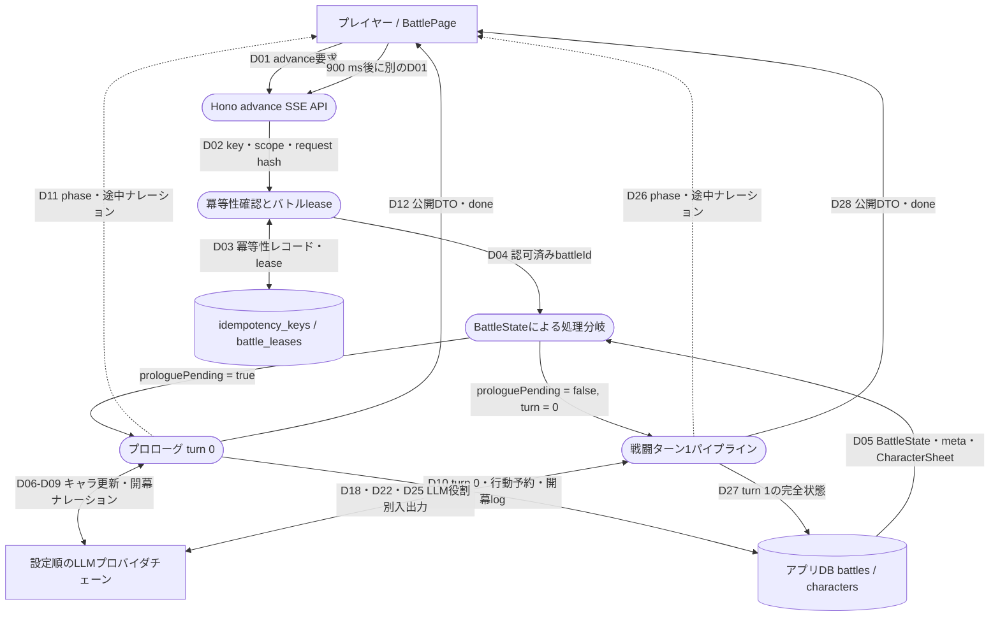
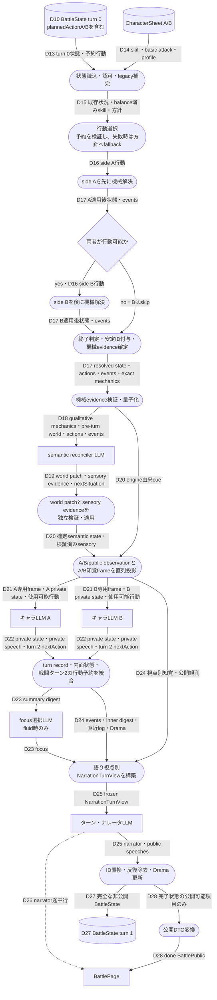
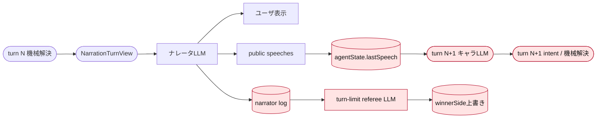
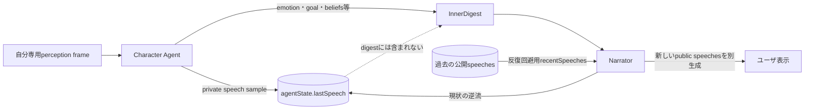

# 先頭1ターンのパイプライン DFD

作成日: 2026-08-05（Asia/Tokyo）

基準線: `origin/HEAD = origin/main` / `206a1b0fded3054c8f590589ca1316e3cd4cf342` / `v0.5.1`

統合ブランチ: `feature/battle-fit-gap-v051-20260805`

根拠: 上記基準線を `git show` / `git grep` で読み直したソースコードと要件。
実際の試合をトレースした結果ではない。旧作業線の実装や、この文書と同時に
統合中の変更は「現状」判定へ含めない。

## 1. スコープと先に分かったこと

ここでいう「先頭1ターン」は、試合作成済みの `BattleState` から、開幕表示を経て、戦闘ターン1の結果が保存・表示されるまでとする。

v0.5.1 の実装では、これは1回の advance では完了しない。

1. **advance 1回目:** `turn = 0` のプロローグを生成・保存する。戦闘エンジンは動かない。
2. **advance 2回目:** 戦闘ターン1を機械解決し、意味状態・知覚・内面・公開ナレーションを生成して保存する。

また、プロローグ処理中のキャラエージェントが `plannedActionA/B` を生成するため、**戦闘ターン1の行動は戦闘ターン1が始まる前に予約済み**である。戦闘ターン1後のキャラエージェント出力は、戦闘ターン2の予約になる。

## 2. 記法

- 四角: 外部主体
- 角丸: サーバー内処理
- 円筒: 永続データストア
- 破線: 保存完了前にも送られるストリーム表示
- `Dxx`: 後続のデータフロー表のID

## 3. コンテキスト DFD



## 4. プロローグ（advance 1回目）の DFD

```mermaid
flowchart LR
  DB0[(BattleState turn 0<br/>prologuePending true)]
  P1([初期A/B知覚frameから<br/>キャラ入力を構築])
  A[キャラLLM A]
  B[キャラLLM B]
  P2([内面状態と<br/>戦闘ターン1の行動予約を統合])
  P3([語りfocusとinner digestを解決])
  F[focus選択LLM<br/>fluid時のみ]
  N[プロローグ・ナレータLLM]
  P4([ID置換・開幕見出し補正])
  DB1[(BattleState turn 0<br/>prologuePending false)]
  DTO([公開DTO変換])
  UI[BattlePage]

  DB0 -->|D05 初期frame・agent state・方針・戦場| P1
  P1 -->|D06 A専用入力| A
  P1 -->|D06 B専用入力| B
  A -->|D07 private state・private speech・nextAction| P2
  B -->|D07 private state・private speech・nextAction| P2
  P2 -->|D08 plannedActionA/B・turn record| P3
  P3 -->|D09 summary digest| F
  F -->|D09 focus| P3
  P3 -->|D09 開幕素材・許可済みdigest・focus| N
  N -.->|D11 narrator途中行| UI
  N -->|D09 narrator・public speeches| P4
  P4 -->|D10 log追加・prologuePending false| DB1
  P4 -->|D12 完了状態| DTO
  DTO -->|D12 数値を除いたBattlePublic| UI
```



初期知覚frameは self のreserve cueを持つ一方、counterpartは `legacyCounterpartIdentified = false` で初期化される。そのため、キャラLLMは相手を識別できない初期frameから戦闘ターン1の行動を選ぶ。一方、プロローグ・ナレータLLMには両者の表示名、traits、blurb、戦場、過去対戦要約が別経路で渡る。

## 5. 戦闘ターン1（advance 2回目）の詳細 DFD



### 5.1 戦闘ターン1に固有の分岐

| 項目 | ターン1の実装動作 | 影響 |
|---|---|---|
| 一時パラメータの基準値復元 | `turn > 1` でのみ実行するため、ターン1では行わない | 装備・開始時補正を含む初期値のまま解決する |
| 戦場イベント | battlefield があれば terrain・obstacles・conditions から「戦場の気配」eventを追加する | ナレーションとsemantic入力には入るが、それ自体は数値効果を持たない |
| 膠着時happening | `upcomingTurn <= 2` では禁止 | ターン1で `proposeHappening` は呼ばれない |
| environment beat | `upcomingTurn > 1` が必要 | ターン1では `environmentBeatDue = false` |
| 行動順 | 常に A を適用してから、双方が行動可能なら B を適用する | Aの行動でBが戦闘不能になるとBは予約済みでも実行されない |
| semanticの状況係数 | semantic reconciler は機械解決後に呼ばれる | `nextSituation` はターン1の解決には遡及せず、保存後の状態に効く |

## 6. データフロー表

### 6.1 API、プロローグ、永続化

| ID | 送信元 → 送信先 | 主なデータ | 区分 | 保存 | 補足 |
|---|---|---|---|---|---|
| D01 | BattlePage → advance SSE API | Bearer認証、battleId、空JSON、`Idempotency-Key` | 制御 | keyのみ | 初回は1,000 ms、以後は900 ms待って自動送信する |
| D02 | API → 冪等性ガード | userId、`battle-advance:{battleId}`、key、request hash | 制御 | yes | 同じkeyなら完了レスポンスを再生できる |
| D03 | ガード ↔ 制御DB | processing/completed response、lease owner、期限 | 制御 | yes | leaseは同一battleの同時進行を拒否する |
| D04 | ガード → battle service | 認可済みuserId・battleId、progress callback | 制御 | no | service内でも所有者を再確認する |
| D05 | DB → service | BattleState、battle meta、A/B CharacterSheet | server exact / private | 元からyes | `state_json`には生パラメータ、内面、semantic、知覚frameを含む |
| D06 | service → キャラLLM A/B | 自分のprofile、previous private state、初期知覚frame、turn 1の使用可能行動 | observer-limited / private | input自体はno | A/B入力を分離・freezeし、並列に呼ぶ |
| D07 | キャラLLM A/B → service | 更新private state、private reaction `speech`、`nextAction` | private | state/actionはD10へ | `speech` は公開台詞ではない |
| D08 | service内部 | turn 0 record、agentStateA/B、`plannedActionA/B` | server exact / private | D10へ | `plannedAction` が戦闘ターン1で一度だけ消費される |
| D09 | service ↔ focus/prologue LLM | 開幕event、両者名・traits・blurb、戦場、方針、過去対戦、許可済みdigest、focus → narrator/public speeches | mixed → public candidate | D10へ | fluid以外はfocus LLMを呼ばない |
| D10 | service → battles | `turn = 0`、`prologuePending = false`、agent state、turn record、行動予約、開幕log | server exact / private | yes | ここで初めてプロローグadvanceが確定する |
| D11 | service → BattlePage | `phase`、生成途中のnarrator行、speeches | public candidate | no | 完全状態の保存より前に表示され得る |
| D12 | service → BattlePage | 数値・内面・private frameを除いた `BattlePublic` と `done` | public | client stateのみ | `turn` はまだ0 |

### 6.2 戦闘ターン1

| ID | 送信元 → 送信先 | 主なデータ | 区分 | 保存 | 補足 |
|---|---|---|---|---|---|
| D13 | battles → turn service | turn 0状態、`plannedActionA/B`、既存situation・semantic・frame・registry | server exact / private | 元からyes | プロローグ完了後の状態を読む |
| D14 | characters → engine準備 | A/B skill、basic attack、profile、base parameters | server exact / private | 元からyes | skillは解決直前にbalance clampされる |
| D15 | service → engine | state、balance済みskill、basic attack、既存situation、happening | server exact | no | ターン1のhappeningは常にnull |
| D16 | 行動選択 → engine | 検証済みA/B action。予約が無効、または反復回避規則で不採用ならpolicy、さらにstanceへfallback | server exact | D27へ | playerのターン内入力で選ぶ構造ではない。ターン1では反復履歴がないため、通常はプロローグ予約を使う |
| D17 | engine → evidence段 | resolved state、安定action/event ID、適用結果、before/after、attempted/effective delta、終了判定 | server exact / private | 一部D27へ | 数値効果と勝敗を確定する唯一の段階 |
| D18 | evidence段 → semantic LLM | pre-turn semantic、actions/events、キャラ説明、戦場、量子化済みabsolute/relative band・outcome | qualitative / server controlled | no | 生パラメータ値・比率・閾値は渡さない |
| D19 | semantic LLM → validation | JSON Pointer world patch、非機械sensory evidence、nextSituation | untrusted proposal | no | worldとsensoryを独立検証する。片方の失敗で他方を無条件破棄しない |
| D20 | validation/evidence → projection | 確定semantic、engine cue、検証済みsensory、reserve cue、直前registry | server exact + qualitative | D27へ | projection失敗時は最小frameへfallbackする |
| D21 | projection → キャラLLM A/B | 各自専用のfrozen frame、自分のprofile/private state、turn 2の使用可能行動 | observer-limited / private | input自体はno | 相手名・状態はframeが許可した場合だけ付加する |
| D22 | キャラLLM A/B → service | 更新private state、private reaction、`plannedActionA/B` for turn 2 | private | D27へ | A/Bを並列実行。片側失敗時はその側の旧stateを維持する |
| D23 | service ↔ focus LLM | 薄いA/B summary digestとevents → focus | private summary / control | no | narration styleがfluidの時だけ呼ぶ |
| D24 | service → narration view builder | perspective、focus、知覚frame、public observation、events、action beats、許可済みinner digest、直近log、Drama | mixed / bounded | no | builderが語り視点に応じて世界・人物情報を削る |
| D25 | service ↔ narrator LLM | frozen `NarrationTurnView`、直近文、Drama、style、digest → narrator・public speeches | public candidate | D27へ | 同一ターンの機械解決は既に完了している。ただしserviceは公開台詞をagent stateへ戻す。論理呼出しは最大2回試行する |
| D26 | service → BattlePage | phase、途中narrator行、speeches | public candidate | no | clientは途中speechesを無視し、保存済みlog受信後に段階表示する |
| D27 | service → battles | turn 1の全状態、semantic、最新A/B/public観測、最新frame/current registry、agent state、turn record、Drama、log、turn 2予約 | server exact / private | yes | 過去frameは蓄積しない |
| D28 | battles/service → BattlePage | `BattlePublic`: 表示名、scene、公開semantic observation、log、状態、勝敗等 | public | client stateのみ | 生パラメータ、agent state、private frame、registry、turn recordは除外する |

## 7. LLM論理呼出し数

「1」はprovider routerに対する論理呼出し数である。実HTTP回数は、設定順providerへのfallbackで増える場合がある。

| advance | 役割 | 通常の論理呼出し | 並列・再試行 |
|---|---|---:|---|
| プロローグ turn 0 | キャラエージェント | 2 | A/B並列 |
| プロローグ turn 0 | focus選択 | 0 または 1 | fluid時のみ |
| プロローグ turn 0 | prologue narrator | 1 | service再試行なし。失敗時は固定fallback文 |
| 戦闘ターン1 | semantic reconciler | 1 | reviewed XAI/OpenAI構成はworld + sensoryのcombined応答 |
| 戦闘ターン1 | キャラエージェント | 2 | A/B並列 |
| 戦闘ターン1 | focus選択 | 0 または 1 | fluid時のみ |
| 戦闘ターン1 | turn narrator | 1 | serviceが最大2 attempt。各attempt内でprovider fallbackし得る |

したがってprovider fallbackを数えない通常経路は、プロローグが3または4呼出し、戦闘ターン1が4または5呼出しである。

## 8. 納得しづらい挙動の調査ポイント

以下の「実装確認」はコードから確定できる事実、「条件付きリスク」は障害タイミングが一致した時に起こり得るコード上の推論であり、実試合での発生確認ではない。

| 優先 | 観点 | 判定 | 現在の説明 | 次に採る証拠 |
|---:|---|---|---|---|
| 1 | ターンが飛ぶ、同じ操作で2段進む | **条件付きリスク** | frontendの1回のretryごとに新しい `Idempotency-Key` を生成する。先行要求が保存まで完了し、`done`だけ失われた場合、retryは同じ要求の再生ではなく次のadvanceとして受理され得る | request key、開始時/保存時のturn、`done`送信結果を同一correlation IDで記録する |
| 2 | ターン1の行動が相手や開幕描写と噛み合わない | **実装確認** | turn 1 actionはプロローグ中に、初期のcounterpart未識別frameから予約する。プロローグの公開描写自体はその後、より広い別入力から生成される | prologue agent input frame、返却nextAction、turn 1で実際に採用したaction sourceを並べる |
| 3 | 主観視点なのに開幕で未知の相手を説明する | **実装確認** | normal turnは視点別`NarrationTurnView`を使うが、prologue narratorには常に両者の名前・traits・blurbを直接渡す。初期frameのcounterpart未識別境界とは一致しない | narration perspective、初期frame、prologue prompt payload、公開開幕文を比較する |
| 4 | 片側だけ行動しない | **実装確認** | Aを常に先に適用し、Aの解決後にどちらかがdownならBをskipする。SPD比較による行動順決定はこの経路にない | `actions[].executed/skippedReason` とA適用直後のcanFightを記録する |
| 5 | キャラらしい反応と画面の台詞が一致しない | **実装確認** | character agentの`private speech`は公開されず、narratorが公開speechesを別生成する。通常は公開台詞がagentStateの`lastSpeech`を上書きする | agent private speech、narrator speech、保存後lastSpeechを役割別に比較する |
| 6 | 台詞を読み終える前に次ターンが始まる | **実装確認** | 次advanceは前回レスポンス後900 msで開始するが、公開台詞は1行780 ms間隔で表示し、表示完了はadvanceをblockしない | `done`、speech reveal各行、次advance開始のbrowser timestampを採る |
| 7 | ターン1で提案された状況が攻撃結果に反映されない | **実装確認** | semantic `nextSituation` は機械解決後に生成・適用されるため、同じターンの数値解決には遡及しない | engine入力situationと、semantic適用後situationをrevision付きで比較する |
| 8 | 同じ試合でも文体・知覚品質が揺れる | **条件付きリスク** | 各LLM役割は設定順provider chainを独立にfallbackする。1ターン内で役割ごとの実providerが異なる可能性がある | role、provider、model、attempt、timeout/fallback reasonを記録する |
| 9 | Side Aばかり先に動き、相討ちにならない | **実装確認** | 行動順は常にA→Bで、A適用後にどちらかがdownならBをskipする。`spd`は存在するがinitiativeには使わない | 両intent、解決前spd、実行bucket、before/after、skip理由を同一turn recordへ記録する |
| 10 | ナレータの言い回しで次の行動や判定が変わる | **実装確認** | 公開台詞をagent stateの`lastSpeech`へ戻し、turn-limit refereeにはnarrator logを渡してengine winnerを上書き可能にする | narrator出力から非表示状態・winnerへ到達する全edgeをtraceする |

## 9. 希望要件との差異評価

「ナレータが影響されない」は、ナレータが戦闘内容を参照しないという意味ではなく、**ナレータ出力から正準世界・キャラ判断・行動結果・勝敗へ戻る因果edgeを持たない**という意味で評価した。

判定は次の3段階とする。

- **適合:** 通常経路とfallbackの双方で要件を満たす。
- **部分適合:** 要件のための境界はあるが、別経路で越境または未適用がある。
- **不適合:** 要件の主要な因果関係を現在のモデルでは保証できない。

### 9.1 総合評価

| ID | 希望要件 | 判定 | 現在できていること | 主要な差異 |
|---|---|---|---|---|
| R1 | ナレータは情報提供だけを担い、戦闘・キャラ・勝敗へ影響しない | **不適合** | 通常ターンの機械解決はnarrator呼出しより前に確定する | 公開台詞が各agentの`lastSpeech`となって次行動へ戻る。turn limitではnarrator文をreferee入力にしてwinnerを上書きできる |
| R2 | 距離・接触・遮蔽などに照らして現実的に知覚する | **不適合** | observer別frame、access、identity、感覚modality、検証済みevidenceの境界はある | 物理的な距離・向き・遮蔽・照明・接触を表す正準モデルとサーバー判定がない。初期状態は同じsceneにいるのに感覚証拠ゼロで相手accessが`none`になる |
| R3 | 各キャラは自分の記憶・意識・知覚可能情報だけから、実行可能な行動を選ぶ | **部分適合** | agent入力は自分のprofile、private state、frozen frame、条件付きcounterpartに分離される | 使用可能行動は主に自己resourceだけで作り、距離・対象・object・場面制約を含まない。無効intentのfallbackは正準の相手HPと、試合前に相手全情報から作ったpolicyを利用する |
| R4 | キャラ・場面・object・effectが相互干渉し、自覚・無自覚の双方へ反映される | **不適合** | skill/equipment、全体`situation`係数、限定的な`envHits`は機械状態へ作用する。semantic worldはentityと変更履歴を持つ | semantic object/位置/effectをengineが読まず、行動可否や効果へ一般的に作用しない。潜在効果と「非知覚だが行動を拘束する制約」を分離して持たない |
| R5 | Sideに依存しない公平な時間順で、必要なら相討ちを表せる | **不適合** | 両者down時のdraw終局自体は定義済み | 通常の両intentはAを先にmutateし、Aでdownが発生するとB intentを破棄する。`spd`によるinitiativeも同時commitもない |
| R6 | 公開台詞もキャラ自身の認知・記憶・状態から決まり、他者には知覚可能な範囲で届く | **不適合** | character agentは自分のframeから非公開`speech`を生成する | その文面はnarratorへ渡らず、公開` speeches[]`はnarratorが別生成する。発話能力の制約、発話event、受け手側の聴覚・理解投影もない |

### 9.2 ナレータ独立性

同一ターンの攻撃結果だけを見ると、engine確定後にnarratorを呼ぶため一方向である。しかし保存される状態と最終判定まで含めると、現在は次のfeedbackがある。



既存要件の「ナレータは状態を変更しない」「効果と勝敗はengineのみが確定する」とも一致しない。必要な修正境界は次のとおり。

1. narratorの`public speeches`を`agentState.lastSpeech`へコピーしない。キャラの継続記憶にはcharacter agent自身のprivate reactionだけを保存する。
2. 公開台詞の反復回避が必要なら、agent stateではなくnarration専用の`DramaState`だけで保持する。
3. turn-limit勝敗は正準の`turnRecords`、機械差分、ルール化したscoreから決定する。refereeはその確定結果を説明するだけとし、`winnerSide`を変更できないようにする。
4. narrator失敗、fallback、再試行のいずれでも、保存される戦闘状態と次のagent入力が同一になることを回帰テストする。

### 9.3 公開台詞とキャラ自身の発話

現在は、公開台詞とは別にcharacter agentが`speech`を生成している。ただしこれは「ナレータに渡す台詞案」ではない。



具体的には次の状態である。

- character agentの`speech`は、自分のprofile、private state、知覚frame、使用可能行動を読んだ後に生成される。この点では認知境界を通っている。
- `speech`はagent自身の`lastSpeech`へ保存されるが、`InnerDigest`には`lastSpeech`や`speech`本文が含まれない。narratorが受けるのは感情、目的、状態、信念、最近の観測、private memoryの短いhint、話し方、一人称である。
- narratorは過去にnarrator自身が生成した公開`recentSpeeches`を反復回避用に受け取る。
- 現在画面に出る新しい`public speeches`はnarratorが独自に生成し、その結果がagentの`lastSpeech`を上書きする。

したがって、**キャラが認知処理後に発話を確定し、narratorを経由せず公開するなら、ナレータ独立性の要件に適合する**。narratorが確定済み発話eventを読み取り専用の事実として受け取ること自体は問題ない。問題になるのは、narratorが台詞の意味を決める、書き換える、またはその生成文をキャラ記憶へ戻す場合である。

希望する発話経路は次のとおり。

1. post-actionのobserver frameを受けたcharacter agentが、`nextAction`とは別に`utteranceProposal`を生成する。発話しない選択も認める。
2. serverが意識状態、発話不能、口を塞がれている、距離、媒体、言語、テレパシー等のworld制約と、発話対象が本人に認知可能かを検証する。
3. 検証済み発話を正準の`UtteranceEvent`としてcommitする。公開画面は、この確定eventから決定論的に台詞を表示し、narratorの生成結果を待たない。
4. 他キャラには、音量、距離、遮蔽、聴覚、言語理解、精神状態に応じた`ObservedUtterance`だけを次のperception frameへ入れる。聞こえたが話者不明、声だけ、意味不明、幻聴等も区別する。
5. narratorは公開可能な`UtteranceEvent`を、既に起きた事実として地の文へ接続できるが、本文・話者・意味を変更しない。narrator contractから新規` speeches[]`生成責務を外す。

同一turnでA/Bが発話する場合は、両者が発話前の同じframeから独立に決め、commit後に互いの聴取結果を次turnへ反映する。相手の発話へ同じturn内で応答させる場合だけ、戦闘actionとは別の明示的なdialogue phaseが必要になる。

### 9.4 現実的な知覚

現在のsemantic schemaでは両キャラは同じ`scene.area`に置かれ、character entityは双方から観測可能でなければならない。一方、実際のframe投影は`sensoryEvidence`だけを走査し、初期fallbackは証拠ゼロ・counterpart未識別で作る。このため、**世界schema上の可視性が知覚accessの下限として使われていない**。

厳密な座標・物理simulationは不要だが、`scene / held / attached / absent`だけでは次を安定して判定できない。

- ほぼ密着、手が届く、同じ部屋、遠距離といった相対距離
- 向き、視野、遮蔽、暗さ、煙、騒音
- 接触中、拘束中、物体の背後などの関係
- キャラごとの視覚・聴覚・特殊感覚と、その一時的な低下

感覚LLMが返す`accessBySide`はschema、event ID、entity存在までは検証するが、物理状態との整合は検証しない。したがってLLMは現象の言語化には使えても、accessの最終権限にはできない。

必要なのは、正準世界からサーバーが最低限の`physical access`を導出し、その範囲内でのみLLM evidenceを採用する層である。座標ではなく、次の粗い状態で足りる。

| 状態群 | 例 | accessへの使い方 |
|---|---|---|
| 相対位置 | `contact / near / far / out_of_scene`、同一zone | contactまたはnearで通常状態なら、相手accessの下限を`coarse`以上にする |
| 存在・露出 | `present / concealed / invisible / absent` | `concealed`等へ変わる明示的transitionがある時だけaccessを下げる |
| 身体・感覚 | 意識、目隠し、失明、聴覚低下、拘束、向き | 使用可能modalityと精度を制限する |
| 環境 | 暗闇、煙、壁、騒音 | 視覚・聴覚ごとの遮断または減衰に使う |
| 精神・認知effect | 混乱、幻覚、魅了、恐怖 | 見えている現象と、その解釈・帰属を分けて歪める |
| 外見・正体 | 変身、変装、分身 | 正準entityとobserverが認識する姿・正体を分離する |

初期frameは`legacyCounterpartIdentified`の一律booleanではなく、battle開始時の位置・露出・感覚状態から決定論的に作る。両者が同じzoneへ通常状態で登場するなら、少なくとも存在と外形を知覚可能にし、対戦相手として紹介済みならidentityも`identified`にする。最初から隠密、透明、別室、目隠し等が明示されている場合だけaccessを下げる。

現在は各turn開始時にregistryの`currentAccess`を一度`none`へ戻し、そのturnの`sensoryEvidence`だけで復元する。identityは前frameから維持するが、現在のaccessは証拠が欠けるだけで消える。希望動作では次の規則に変える。

1. 同じ正準位置・露出・感覚条件が続く限り、前turnのbaseline accessを維持する。
2. `hide / disappear / leave / invisible / occluded / blindfolded / unconscious`等の構造化された状態transitionだけがbaseline accessを下げる。
3. LLM evidenceの欠落、provider failure、projection fallbackだけでは、既知の相手を知覚不能へ変更しない。
4. 一度識別したidentity memoryは見失っても消さない。ただし`currentAccess`と`lastConfirmedTurn`は別に持ち、「誰か知っているが今は見えない」を表せるようにする。
5. 変身・変装・幻覚では、正準identityを上書きせず、observer別の`apparentForm / apparentIdentity / confidence`を更新する。変身を目撃した場合と、見ていない間に変身した場合を区別する。
6. 幻覚は正準entityそのものにせず、精神effectに根拠を持つobserver-local phenomenon/contactとしてframeへ出す。キャラの判断には影響してよいが、世界の実在物へ自動昇格させない。

この構成なら「見えている相手が、何も起きていないのに次turnで消える」を防ぎつつ、隠密、消失、目隠し、変身、幻覚による誤認は明示的に扱える。

### 9.5 キャラ判断と世界制約

primaryのcharacter-agent入力分離は希望に近い。ただし「選択できる」と「世界内で実行できる」はまだ別になっていない。

| 層 | 現在 | 希望要件に必要な形 |
|---|---|---|
| 記憶・意識 | `previous` private stateとperception frame | 維持する。narrator由来の公開台詞を混入させない |
| 相手情報 | access/identityに応じて名前・概況を付加 | 維持する。対象はobserver-local handleで選ばせ、正準IDを直接見せない |
| 行動候補 | basic/defend/rest/waitと、MP・stamina・finisher条件を満たすskill | serverがworld revision、距離、姿勢、拘束、object、対象、場面ルールまで含めた`FeasibleAction`を生成する |
| agent出力 | `kind / skillId / useFinisher` | 発行済みaction handleと知覚可能なtarget handleだけを返す |
| 実行前検証 | skill存在、自己resource、finisherを再確認 | 同じworld revisionまたは明示した競合規則で全preconditionを再検証する |
| fallback | policyを正準の自他HPで評価し、stanceへfallback | 同じobserver-safe decision contextだけから決定する。隠れた相手HP・未認知entityを参照しない |

現在のaction schemaにはtarget、位置、object操作がなく、`resolveTurn`にも`semanticState`やaffordance集合を独立入力する境界がない。このため「壁越しの近接攻撃不可」「拘束中は移動不可」「持っていない物は使えない」等を表現できない。

### 9.6 自覚・無自覚を含む干渉

希望要件を満たすには、効果そのものと、その効果をキャラが知覚したかを分ける必要がある。

- **正準効果:** 原因、対象、期間、parameter modifier、行動precondition、移動・知覚制約をserver-privateに保持し、認知の有無にかかわらずengineが適用する。
- **自覚投影:** 視覚、痛み、手応え、知識等から検出できた部分だけをperception frameへ出す。
- **無自覚反映:** frameには原因や効果名を出さなくても、`FeasibleAction`の減少、命中・移動・回復へのmodifier、身体感覚の曖昧なcueとして現れる。
- **object/scene干渉:** objectの位置・状態変化をsemantic表示だけで終わらせず、affordanceとeffect resolverが次の解決で読む。

現在の`nextSituation.coefficients`は次ターンへ作用する限定的な橋だが、場全体の係数であり、どのentityが誰へどう干渉したか、誰がそれを認知したかを保存しない。

### 9.7 Side A / Side Bの公平な時間順

候補は次の3方式である。

| 方式 | 相討ち | `spd`の意味 | Side固定bias | 主な注意点 |
|---|---|---|---|---|
| 全行動を完全同時commit | 自然に可能 | 原則なくなる | ない | 防御・interrupt・移動競合のmerge規則が必要 |
| `spd`順の完全逐次解決 | 通常は不可 | 明確 | ない | 先手KOで後手intentが消え、速度が強すぎる可能性がある |
| **initiative bucket方式（推奨）** | 同一bucketで可能 | 明確 | ない | bucket内の同時effect merge規則が必要 |

推奨するinitiative bucket方式は、両者のintentを同じturn開始snapshotへ固定してから次の順で解決する。

1. turn開始時の正準world、combatant、継続effectを`W(t)`としてfreezeする。
2. A/Bの`FeasibleAction`とintentを同じrevisionに対して確定する。
3. serverが`effectiveSpd + actionPriority + 確定modifier`からinitiativeを決める。LLM、narrator、Side IDは使わない。
4. 同値または仕様で定めた同値帯を同じbucketにする。異なるbucketはinitiative順に処理する。
5. 同一bucket内では各actionのeffectを同じpre-bucket snapshotから純粋計算し、全proposalを原子的にmergeする。これにより双方の攻撃が成立した相討ちを表現できる。
6. bucket確定後、次bucketのactorがまだ行動可能か、拘束や対象消失を含めて再検証する。
7. 全bucket確定後に戦闘不能とwinnerを一度だけ判定する。双方downならdrawとする。

同時bucketでは、少なくとも「加減算deltaの合算」「resource costは各intentにつき一度」「同じobjectの排他的取得」「防御が同bucketの攻撃へ効くか」「状態付与と解除の優先度」を明文化する必要がある。配列表示順を安定させるためA/B順に並べても、効果計算の入力snapshotとcommit結果はSide順に依存させない。

### 9.8 希望する因果構造の DFD

```mermaid
flowchart TB
  W0[(W(t) 正準world<br/>combatants・entities・relations・effects)]
  PR([物理・知覚・affordance resolver])
  PA[(Aのprivate memory / conscious frame)]
  PB[(Bのprivate memory / conscious frame)]
  FA[FeasibleAction A]
  FB[FeasibleAction B]
  AA[Character Agent A]
  AB[Character Agent B]
  IF([intent freeze・server再検証])
  IQ([initiative bucket決定])
  EA([A effect純粋計算])
  EB([B effect純粋計算])
  CM([bucket単位atomic merge])
  W1[(W(t+1) 正準world)]
  UV([発話能力・認知境界を検証])
  UE[(確定UtteranceEvent)]
  AW([自覚可能部分だけを投影])
  RESULT([決定論的な終了・winner判定])
  NV([公開NarrationView生成])
  N[ナレータLLM]
  UI[ユーザ]

  W0 -->|G01 正準状態・潜在effect| PR
  PR -->|G02 observer-safe frame| PA
  PR -->|G02 observer-safe frame| PB
  PR -->|G03 世界制約込み候補| FA
  PR -->|G03 世界制約込み候補| FB
  PA --> AA
  FA --> AA
  PB --> AB
  FB --> AB
  AA -->|G04 A action intent| IF
  AB -->|G04 B action intent| IF
  AA -->|G04 A utterance proposal| UV
  AB -->|G04 B utterance proposal| UV
  W0 -->|G05 発話・媒体制約| UV
  W0 -->|G05 revision・実行precondition| IF
  IF -->|G06 検証済み両intent| IQ
  IQ -->|G07 同一bucket| EA
  IQ -->|G07 同一bucket| EB
  W0 --> EA
  W0 --> EB
  EA -->|G08 effect proposal| CM
  EB -->|G08 effect proposal| CM
  CM -->|G09 atomic diff| W1
  UV -->|G13 検証済み発話| UE
  W1 -->|G10 正準結果| RESULT
  W1 -->|G11 検出可能な変化| AW
  UE -->|G11 聴取・読唇・精神伝達の対象| AW
  AW --> PA
  AW --> PB
  W1 -->|G12 公開可能な確定事実| NV
  RESULT -->|G12 確定結果| NV
  UE -->|G12 読取り専用の確定発話| NV
  UE -->|G13 perspective-safe public speech| UI
  NV --> N
  N -->|G14 地の文のみ| UI
```

重要な不変条件は、ナレータから`W(t+1)`、private memory、intent、initiative、winnerへのedgeが存在しないことである。潜在effectは`PR`とeffect計算には常に入るが、検出されなければA/Bのconscious frameには入らない。

### 9.9 希望DFDのデータフロー表

| ID | データ | 権限・可視性 | 必須の不変条件 |
|---|---|---|---|
| G01 | combatant、entity、location/relation、継続effect、scene rule | server exact / private | 1つのrevisionがmechanicsの唯一の正準入力になる |
| G02 | self、counterpart/other contact、感覚cue、identity/access、検出済みeffect | observer-limited / private | 相手専用状態、未検出effect、正準IDを含めない |
| G03 | action handle、知覚可能target、resource、range、world precondition | observer-limited / private | 実際に候補生成時点で可能な行動だけを出す |
| G04 | 選択action handle、target handle、発話または沈黙proposal | character-private | 発行されていないhandle、未認知target、認知外の発話内容を受理しない |
| G05 | world revision、resource、位置、拘束、対象存在、scene rule、発話・媒体能力 | server exact | agent出力を信用せずcommit直前に再検証する |
| G06 | A/Bの検証済みintent | server exact | 両intentを同じturn開始revisionへ固定する |
| G07 | initiative score、bucket、決定根拠 | server exact / audit | narratorとSide固定順を根拠にしない |
| G08 | parameter delta、状態・位置・object変更、cost、根拠intent | server exact proposal | 同bucket内は同じpre-bucket snapshotから計算する |
| G09 | conflict rule適用済みworld diff | server exact | merge順をA/Bで入れ替えても同じ結果になる |
| G10 | 戦闘不能、継続可否、winner、finish reason | server exact | proseではなくcommit済み状態だけから決める |
| G11 | 確定変化・発話のうち各observerが検出・理解可能なsubset | observer-limited / private | 無自覚effectは隠しても機械制約からは除かない。発話は距離・感覚・言語で投影する |
| G12 | 公開可能なworld diff、action beats、確定結果、確定発話 | public-safe | 生parameter、未検出情報、private memoryを含めない |
| G13 | speaker、本文/意味、媒体、対象、発話ability根拠 | canonical event → perspective-safe public | narratorを経由せず表示し、受け手側perceptionの入力にもする |
| G14 | narrator paragraphs | public | 確定eventを説明するだけで、台詞・世界・agent stateへ書き戻さない |

### 9.10 対応優先度

| 優先 | 対応 | 理由 |
|---:|---|---|
| P0 | narrator speech→agent stateとnarrator log→winnerのfeedbackを切る | 既存の責務境界と希望要件へ直接違反し、LLM文面が将来行動・勝敗へ影響する |
| P0 | character agentの認知済み発話を`UtteranceEvent`として直接commitし、narratorから台詞生成責務を外す | 公開台詞の主体と認知境界をキャラ側へ戻す |
| P0 | 固定A→Bをinitiative bucketへ置換し、turn recordに順序根拠を残す | 現在のSide依存biasを除去し、相討ちを仕様化する |
| P1 | 粗い位置・露出・身体/精神・感覚状態から初期accessと継続baselineを導出する | 「密着しているのに見えない」「何もないのに次turnで消える」を構造的に防ぐ |
| P1 | world制約込み`FeasibleAction`とcommit時再検証を導入する | キャラの知識境界と世界内の実行可能性を一致させる |
| P2 | semantic entityを正準effect/affordanceへ接続し、自覚projectionと分離する | object・場面・潜在effectの一般的な干渉を可能にする |
| P2 | fallback policyから隠れた相手HP・setup全情報への依存を除く | provider失敗時にもキャラの認知境界を維持する |

## 10. v0.5.1 実装根拠

以下はすべて基準線 `206a1b0fded3054c8f590589ca1316e3cd4cf342` の
同名ファイルと記載symbolを `git show <SHA>:<path>` で確認した。統合ブランチの
行番号は変更され得るため、行番号だけでなくsymbol名を根拠とする。

- 論理パイプラインと役割境界: [`requirements.md`](requirements.md#L219)
- 初期semantic・A/B frame・counterpart未識別の生成: [`battle-engine.ts`](../packages/shared/src/battle-engine.ts) の `createBattleState`
- `prologuePending` による先行分岐: [`battle-service.ts`](../backend/src/services/battle-service.ts) の `advanceTurnWithLease`
- プロローグ内のA/B agent更新と行動予約: 同ファイルの `runPrologueTurn` / `advanceCharacterAgents`
- turn 1の予約行動検証、反復回避fallback、A→B順の機械解決: [`battle-engine.ts`](../packages/shared/src/battle-engine.ts) の `resolveTurn`
- semantic、知覚投影、agent、narrationの接続: [`battle-service.ts`](../backend/src/services/battle-service.ts#L744)
- LLM入出力の役割別contract: [`types.ts`](../backend/src/llm/types.ts#L191)
- provider単位のcombined perception構成: [`perception-topology.ts`](../backend/src/llm/perception-topology.ts#L26)
- provider fallback router: [`fallback.ts`](../backend/src/llm/fallback.ts#L19)
- SSE advanceと冪等性処理: [`routes.ts`](../backend/src/routes.ts#L1196)
- frontendの自動advance、retry、台詞非同期表示: [`BattlePage.tsx`](../frontend/src/pages/BattlePage.tsx#L17)
- retryごとの新規key発行: [`api.ts`](../frontend/src/api.ts#L349)
- narrator公開台詞のagent stateへの書戻しとturn-limit referee: 基準線の [`battle-service.ts`](../backend/src/services/battle-service.ts) `advanceTurnWithLease`
- character-agent入力とresource中心の使用可能行動: [`battle-service.ts`](../backend/src/services/battle-service.ts#L563)
- policy生成時の相手profile入力: [`battle-service.ts`](../backend/src/services/battle-service.ts#L391)
- intent検証、正準HPを使うfallback、固定A→B解決: [`battle-engine.ts`](../packages/shared/src/battle-engine.ts#L788)
- semantic locationとcharacter可視性制約: [`semantic-state.ts`](../packages/shared/src/semantic-state.ts#L54)
- sensory evidenceだけからの投影と初期最小frame: [`perception-projection.ts`](../packages/shared/src/perception-projection.ts#L88)
- sensory evidenceの現行server検証範囲: [`perception-evidence.ts`](../backend/src/llm/perception-evidence.ts#L116)
- narrator非変更、engineによる勝敗確定という既存要件: [`requirements.md`](requirements.md#L195)

## 11. 未確認事項

- 実運用環境での `LLM_PROVIDER_ORDER`、各model、fallback実績はこの調査では読んでいない。
- 実際に違和感が出たbattle ID、各requestの時刻、provider応答、保存前後stateは未取得である。
- 本書は `origin/HEAD` の v0.5.1 を記述する。prologue/aftermathはnormal `narrateTurn` と別contractであり、いずれも基準線ではナレータが公開台詞を生成する。
- v0.5.1 基準線は、shared生成物を同revisionへbuildした後、`npm test`（shared 115、backend 69、frontend 13、deployment 3）と `npm run typecheck` が成功した。
- initiative bucket、physical access、effect/affordance modelは本節の推奨設計であり、現行コードへ実装済みではない。tie帯、action priority、同時merge規則は仕様決定が必要である。
