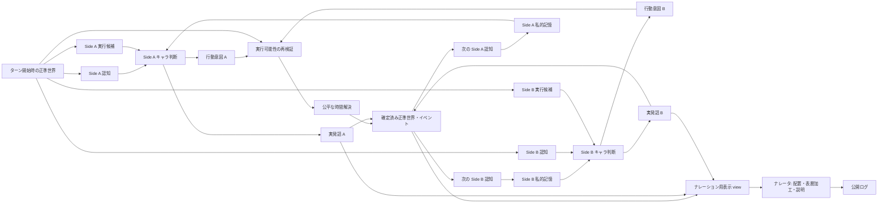
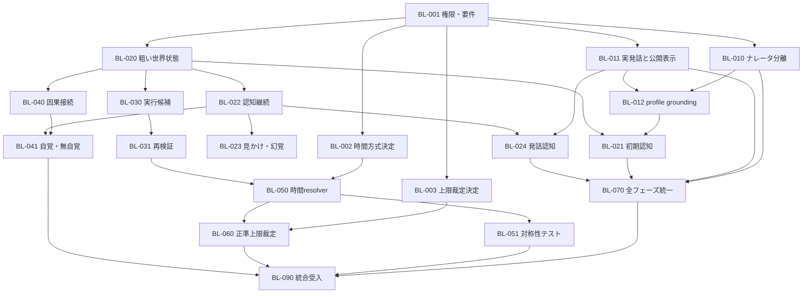

# バトルパイプライン Fit & Gap / バックログ候補

作成日: 2026-08-05
現状スナップショット: `206a1b0fded3054c8f590589ca1316e3cd4cf342` (`origin/HEAD`, `origin/main`, `v0.5.1`)
状態: **Fit / Gap 基準線（実行状態はPERTで管理）**

実行計画: [`battle-fit-gap.pert`](battle-fit-gap.pert)
進捗注記: 基準線の取り違えが判明したため、2026-08-05 に `origin/HEAD` を
fetchして上記SHAへ固定し、ソース調査と正常系テストをやり直した。`T_NARRATOR`
はこの基準線への選択的マージとして再着手する。この文書の Fit / Gap 判定は
上記スナップショット時点に固定し、統合中の実装によって書き換えない。

決定ロック: 勝負がつかない場合は、公開表現を読まない独立した裁定LLMの
生判断（勝者・事実理由）を先に確定し、その裁定と直近の公開ナレーションを
ナレータへ渡してユーザー向けに表現する。公開ナレーションから裁定LLMへの
逆流は禁止する。

時間解決の決定ロック: 2者対戦では `initiative-window-v1` を採用する。
確定済みのターン開始補正を反映した実効速度の差が1以内なら、双方を同一の
開始状態から原子的に解決する。差が2以上なら高速側を先にcommitし、低速側を
commit後の状態で再検証する。同時戦闘不能は引き分け、排他的競合は明示規則が
なければ `contested` とし、Side名や乱数でtie-breakしない。詳細は
[`battle-temporal-resolution.md`](battle-temporal-resolution.md) を参照する。

## 0. この文書の扱い

- 要望は、現在の型・LLM 呼出し回数・既存実装方式に引きずられずに再記載する。
- Fit / Gap の「現状」は、上記 `origin/HEAD` だけを対象とする。
- 統合ブランチ、旧ブランチ、stashにある変更は保持するが、Fit判定の根拠には含めない。
- 本文の候補は `battle-fit-gap.pert` へ計画化済みである。実装の着手・完了は
  PERTのwork eventを正とし、候補の記載だけでは後続タスクの開始を意味しない。
- 座標ベースの厳密な物理シミュレーションは要求しない。

## 1. 要望の再記載

### R-01 ナレータの責務分離

ナレータは、確定済みの事実とキャラクターが実際に発したセリフを、ユーザーへ分かりやすく提示する。ナレータの語り口、視点、創作的表現、失敗、フォールバック結果は、キャラクターの認知・記憶・行動、戦闘効果、時間順序、勝敗へ一切フィードバックしない。

### R-02 セリフの所有権と表示

セリフの内容は、発話キャラクターが自分の記憶・意識・認知可能コンテキストから生成する。ナレータはそのセリフを受け取り、適切な位置へ挿入し、語り方針に沿って表層表現を整えてよい。ただし、話者、事実、意図、肯否、対象、発話行為を変えてはならない。安全に加工できない場合は原文を使う。

キャラクターが実際に発したセリフと、ユーザーへ表示されたセリフは別データとして扱う。公開表示をキャラクター自身の発話記憶へ書き戻さない。

### R-03 セリフも認知対象にする

他キャラクターは、公開画面のセリフではなく、世界内で実際に発生した発話を、距離、遮蔽、騒音、聴覚状態、意識状態、言語理解、幻覚等を通じて認知する。聞こえなかった内容を知ったことにせず、聞き違い・一部認知・話者不明も表現できる。

### R-04 現実的だが粗い世界・状態モデル

厳密な物理モデルは不要だが、少なくとも次の構造化状態をサーバー側の事実として持ち、認知・行動可能性・効果へ反映する。

- 相対位置: 接触、近距離、中距離、遠距離、場外等
- 存在・露出: 同一場面に存在、遮蔽、隠密、不可視、消失、不在等
- 向き・遮蔽・環境: 必要な範囲の正対、背後、障害物、暗さ、騒音等
- 身体・精神・感覚: 戦闘不能、拘束、目隠し、聴覚阻害、混乱、恐怖、幻覚等
- オブジェクト関係: 所有、保持、装着、接触、遮蔽物、使用可能性等

### R-05 初期認知と認知の継続

戦闘開始時に初期世界状態から初期認知を決定する。同じ場に通常の露出状態で対峙している相手は、少なくとも存在・概略位置を認知できる。設定上の面識や名乗り等がなければ、存在を認知しても正体まで自動識別する必要はない。

一度認知した相手への現在アクセスは、LLM が新しい知覚根拠を出さなかったという理由だけでは消えない。隠れる、遮蔽物へ移動する、不可視化する、消える、場外へ出る、観測者が失神する等の構造化された変化がある場合に低下する。識別済みという記憶と、今見えているかは別に保持する。

### R-06 見かけ上の認知

変身、変装、幻覚、偽装等では、正準な実体と観測者が認知している姿・正体を分離する。観測者は誤った見かけを事実だと信じ得るが、その誤認を正準世界の同一性へ上書きしない。

### R-07 キャラクター固有の意思決定

各キャラクターは、次の情報だけから意図とセリフを生成する。

- 自分のプロフィールと能力
- 自分の非公開な記憶・目標・感情・信念
- 自分向けに投影された最新認知
- サーバーが世界状態から算出した、その時点で実行候補になり得る行動

相手の非公開状態、正確な残量、認知できない正体・位置、ナレータ文、他者専用の認知は参照しない。

### R-08 行動の実行可能性

キャラクターが意図した行動でも、世界、場面、位置、状態、資源、対象、オブジェクト関係から実行不能なら、そのまま成功させない。サーバーが実行直前にも検証し、不成立、部分成立、代替、失敗を正準結果として確定する。

### R-09 世界からの自覚・無自覚な干渉

キャラクター、場面、オブジェクト、効果は互いに干渉し、正準な状態・行動可能性・結果へ因果的に反映される。

- 認知できた影響は、認知frameを通じて自覚的な判断材料になり得る。
- 認知できない影響も、行動候補の制約、成功度、状態変化等として働く。
- 無自覚な原因そのものは漏らさず、後から認知可能になった結果だけを認知させてもよい。

### R-10 Side A / Side B の公平な時間解決

Side A 固定先行を廃止する。次のいずれか、または両者を統合した方式を明示的に選ぶ。

1. 完全同時: 同一ターン開始時点から双方の結果を独立計算し、原子的に併合する。
2. 素早さ等による順次処理: Side に依存しないイニシアチブで先後を決め、先行結果を後行へ反映する。
3. イニシアチブ帯: 明確な差は順次、同値または同一帯は同時に解決する。

相討ち、相互妨害、同時移動、先行による後行不能、同値時の競合規則を決め、A/B を入れ替えても同条件なら同じ意味の結果になることを保証する。

### R-11 勝敗の正準性

勝敗は、正準な機械状態と採用済み裁定規則から決定する。上限時に意味的な総合評価が必要でも、評価器はナレータの公開文ではなく正準ターン記録を読む。ナレータの語り口を変えても勝敗は変わらない。

### R-12 自己プロフィールと表示上の人物像の整合

各キャラクターは、自分の正準プロフィールを自己に関する不変の事実として扱う。
表示名、本名・通称・一人称、性別、年齢、外見、traits、設定、技能等について、
過去の私的状態やproviderの補完が正準プロフィールと矛盾する場合はプロフィールを
優先する。未設定値は勝手に具体化しない。

ナレータも、表示専任の範囲で人物像を正しく参照し、性別等を誤認した地の文を
生成しない。ただし、ナレータへ渡したプロフィールはキャラの自己認識へ逆流させず、
視点上非公開の相手情報をキャラ認知として開示しない。

## 2. 目標とする責務・データ境界



重要な非経路は次の通り。

- `公開ログ -> キャラ私的記憶` は接続しない。
- `ナレータ -> 正準世界 / 行動 / 勝敗` は接続しない。
- `Side A 認知 -> Side B 判断` および逆方向は接続しない。
- キャラクターへの発話伝達は `実発話 -> 正準イベント -> 観測者別認知` を通す。

| データ | 事実性 / 所有者 | 主な利用者 | 禁止される利用 |
|---|---|---|---|
| 正準世界状態 | サーバーが確定する事実 | 実行可能性、時間解決、知覚投影、勝敗 | キャラへ未投影のまま全量開示 |
| キャラ別認知frame | 正準世界から観測者別に投影 | 対応するキャラだけ | 他 Side への流用、正準世界の上書き |
| 私的記憶・意識 | 各キャラ固有 | 対応するキャラだけ | ナレータ文による上書き |
| 行動意図 | 各キャラの判断結果 | 検証・時間解決 | 未検証のまま正準結果にすること |
| 実発話 | 発話キャラの判断結果 | 発話知覚、ナレータ表示入力 | ナレータが内容を新規決定すること |
| 公開セリフ | 実発話の表示レンダリング | UI | 実発話・私的記憶への書戻し |
| ナレータ文 | 表示専用の説明 | UI | 認知、行動、効果、勝敗の根拠 |
| 勝敗 | 正準状態と裁定規則 | UI、レーティング | 公開ナレーションからの判定 |

## 3. v0.5.1 基準線の要約

現状は、機械解決、セマンティック世界、観測者別知覚、キャラ別の私的状態、ナレーションviewという分離の土台を持つ。一方で、責務の接続方法に要望との不一致がある。

1. 最初の進行は turn 0 のプロローグであり、通常戦闘 turn 1 は次の進行で解決される。
2. 新規戦闘の初期知覚は self 中心の最小frameで、counterpart のアクセスと識別は原則なしで始まる。
3. 通常ターンでは、機械解決、セマンティック更新、知覚投影、A/B キャラエージェント、ナレータの順に処理される。
4. A/B キャラエージェントには別々のframeと私的状態が渡され、次ターン行動と非公開反応サンプルを生成する。
5. 公開セリフはキャラの反応サンプルをソースにせず、ナレータが独自に生成する。
6. ナレータが生成した公開セリフは、キャラの `lastSpeech` へ書き戻される。
7. 通常の戦闘行動は Side A を先に適用し、A の結果でどちらかが戦闘不能なら Side B の行動をスキップする。
8. `spd` は能力値として存在するが、行動順決定には使われていない。
9. 両者戦闘不能を draw とする終了分岐はあるが、通常の A/B 行動を同一開始状態から同時成立させる仕組みはない。
10. 知覚registryの識別知識は保持できるが、現在アクセスは各投影でいったん `none` に戻り、そのターンの知覚根拠から再構築される。
11. セマンティック世界には場面・キャラ・オブジェクト・所在等があるが、相対距離、遮蔽、拘束、感覚阻害等を一貫して行動可否と知覚へ反映するサーバー規則はない。
12. `availableActions` は主に資源・必殺技解禁を判定し、位置・対象・保持物・状態等の世界制約を網羅しない。
13. キャラ意図が使えない場合の既存ポリシー経路は、相手の正確な機械HP比率を条件にできる。
14. 上限判定の審判は、公開ナレータ文の要約を入力として、エンジン仮判定を上書きできる。
15. 既存要件 `F-BTL-05`、`F-BTL-15`、`docs/narration-perspective.md` は、それぞれ LLM 上限判定、ナレータによる公開台詞生成、キャラは公開台詞を所有しない設計を明記しており、今回の要望と要件文書自体が衝突する。
16. キャラLLM入力には自分の `identity.gender`、一人称、traits、blurbが含まれるが、正準プロフィールを過去stateより優先する明示契約と自由文の矛盾検証がない。外見、装備説明等も入力契約に含まれない。
17. 通常ターンのナレータviewには正準な性別・外見・traitsがなく、プロローグもblurb/traits中心であるため、表示上の人物像を誤推定し得る。報告事例はナレータ改善前でrole別の生成物が残っておらず、キャラ自己認識とナレータ誤認のどちらが直接原因かは未確認である。

## 4. Fit & Gap

判定基準:

- `Fit`: 要望を満たす責務と主要経路がある。
- `Partial Fit`: 再利用可能な土台はあるが、重要な経路または保証が不足する。
- `Gap`: 要望と逆向きの経路がある、または必要な仕組みがない。
- `Decision Gap`: 実装前にルール選択が必要である。

| 要望 | 判定 | Fit している点 | Gap / リスク |
|---|---|---|---|
| R-01 ナレータ責務分離 | `Gap` | 通常ターンの機械効果はナレーションより前に確定する | 公開セリフを私的 `lastSpeech` へ書戻す。上限判定がナレータ文を読む |
| R-02 セリフ所有権 | `Gap` | キャラエージェントは非公開の `speech` を生成できる | 公開セリフのソースに使わず、ナレータが別内容を生成する |
| R-03 セリフの認知 | `Gap` | 音を扱える汎用知覚根拠はある | 発話イベントと観測者別の聞こえ方を結ぶ契約がない |
| R-04 粗い世界・状態モデル | `Partial Fit` | セマンティック場面、安定IDのentity、location、factsがある | 距離・遮蔽・感覚・精神・拘束等の共通状態と決定論的解決規則がない |
| R-05 初期認知 | `Gap` | self/counterpart の必須slotはある | 新規戦闘が初期 counterpart access `none` で始まり、対峙状態を反映しない |
| R-05 認知継続 | `Partial Fit` | contact ID と識別知識は継続できる | 現在accessを毎回消し、根拠欠落だけで見失い得る |
| R-06 見かけ上の認知 | `Partial Fit` | `perceivedAs` と識別確度の土台はある | 変身・幻覚・偽装の正準原因、見かけ、信念を分ける遷移規則がない |
| R-07 キャラ固有判断 | `Partial Fit` | A/B の私的状態・認知frame・LLM入力は分離される | 代替ポリシーが相手の正確なHP比率を参照でき、初期方針生成も相手公開プロフィールを無条件に受ける |
| R-08 行動実行可能性 | `Partial Fit` | 資源、技ID、必殺技解禁は検証する | 位置、拘束、対象、オブジェクト、場面制約を候補列挙・再検証しない |
| R-09 自覚・無自覚な干渉 | `Partial Fit` | 機械効果、世界差分、観測者別投影を分離できる | セマンティック物体・状態の多くが戦闘可否・効果へ因果接続されていない |
| R-10 公平な時間解決 | `Decision Gap` + `Gap` | `spd` と両者down時のdraw分岐はある | A固定先行。完全同時 / 速度順 / 帯方式の選択と競合規則が未定 |
| R-11 勝敗の正準性 | `Gap` | 戦闘不能はエンジンが判定し、上限時の仮スコアもある | 審判がナレータ文から勝者を上書きできる |
| R-12 自己プロフィール・表示整合 | `Partial Fit` | キャラLLMは自分のidentity、traits、blurbを受け取り、一人称はサーバーが既存値を優先する | profile優先契約と矛盾検証がなく、外見等が不足する。ナレータviewにも正準identity groundingがなく、報告事例の直接原因は未確認 |
| 全フェーズの一貫性 | `Gap` | 通常ターン用の知覚・ナレーションviewがある | プロローグ、通常ターン、アフターマスでセリフ・認知・表示契約が揃っていない |

### 総評

土台として最も Fit しているのは、正準状態、観測者別frame、キャラ別私的状態、表示viewを分けようとしている点である。主要な Gap は型の不足だけではなく、次の権限逆転にある。

1. 表示担当のナレータが、キャラの公開発話を決め、その結果をキャラ記憶へ返している。
2. 観測根拠の不在を、世界内で見失う原因と同等に扱っている。
3. 世界・場面は記述されるが、行動可能性と結果へ十分に作用しない。
4. 時間解決と上限判定が Side / ナレータ出力に依存し得る。

## 5. バックログ候補

この文書は、改善したい事象と長期的な対応候補を失わないための記録であり、
現在の実装順を決める実行計画ではない。現在の戦闘パイプライン実装は
[`battle-pipeline-production-rollout.md`](battle-pipeline-production-rollout.md) に従い、
PoCで得た仮説のうち軸として重要なものを先に、その中から現行 `main` に
パッチしやすいものを選ぶ。

以下の優先度は依存関係上の仮置きであり、着手承認でも現在の実装順位でもない。

### 5.1 事象バックログ

ここには未解決の事象とユーザー影響を書く。対応方式、実装依存、優先度は
事象から分離し、後続の対応候補または実行計画で扱う。先行する仮説実装により
自然に改善した場合は、その試行結果を根拠に状態を更新する。なお継続する場合も
事象を保持するが、それだけを理由に仮説実装へ割り込む個別修正とはしない。

パイプライン更改候補の順序は、永続E2E観測における正準権限リスク、発生頻度、
再現性、後続観測の阻害度、複数stageへの波及価値、現行mainへのパッチ容易性から
決める。ナレータの言い回し、強調、反復、非正準flavor等の単独品質課題は、
パイプラインが成熟するまでpendingとする。ナレータ出力が正準状態、機械結果、
勝敗、私的認知、認可、privacy、可用性、永続データ完全性を変え得る場合だけを
criticalとして即応対象にする。選択したパイプライン軸が同じ入力・権限境界を
自然に改善する場合は、そのsliceの受入観点として同時に確認する。

| ID | 事象 | 確認例 | 影響 | 状態 |
|---|---|---|---|---|
| OBS-20260807-01 | 公開ナレーションから、確定結果の理由と次ターンへの具体的影響を読み取れない | 本番「大剣のゴウキ」対「情熱直撃ジゴロ・レイジ」のターン1〜8。`v0.7.2` stagingでは囁きから持久力低下へのリンクは明示されたが、同時のHP低下理由は説明されなかった | 動作は分かっても戦況の意味と因果を理解できず、選択や結果への納得感が弱い | partially improved; pending until pipeline maturity |
| OBS-20260807-02 | 環境イベントの表層事象と、同時に確定する機械効果の論理的整合性が保証されない | 同戦闘ターン7で「街灯点滅」と両者のHP低下が同じハプニング提案から発生 | 表示された原因から予測・説明できない正準効果が戦闘結果へ入り、世界の納得感と裁定への信頼を損なう | open |
| OBS-20260807-03 | 公開ナレーションが、正準状態に記録されていない次ターン制約を確定結果として述べる | `v0.9.0` 本番E2E battle `btl_03da078a3011a53dbb5cde76` に加え、role-labelled inputへ変更した `v0.10.0` battle `btl_19dcf0ea770b6263943c2703` でも、水流、足滑り、次の攻防で有利な位置等を述べる一方、対応するsemantic/world changeはfalse | 表示を信じて次の選択を考えてもエンジン側には作用せず、説明可能性と正準世界への信頼を損なう | narrator symptom pending; retain input conflict as pipeline evidence |
| OBS-20260807-04 | Site A / Site B character agentのprovider出力が採用されず、前状態保持へ頻繁にフォールバックする | `v0.10.0` 本番E2E battleの30 side-turn中22件がprovider-level rejected。`v0.11.0` では実呼出し15件が全てfulfilledとなり、stateとspeechを保持した | キャラクタ文脈と次ターン意図の推移が長区間停止し、提案パイプラインのユーザー価値と観測サンプル密度が低下する | provider-level rejection resolved; residual action nonacceptance tracked as OBS-20260807-05 |
| OBS-20260807-05 | character agentの応答は成立するが、提案した次ターン行動がサーバ契約に一致せず全件不採用になる | `v0.11.0` 本番E2E battle `btl_442a384a57ea0952f0d215d4` の実呼出し15件は全てfulfilledした一方、提案15件全てが`schema_invalid`。`v0.11.1`では20/21提案がacceptedとなり同じ全件不採用は再現しなかった | stateとspeechは進むが次ターン行動が更新されず、既定行動の反復、行動多様性低下、提案から裁定までの観測不能が継続する | resolved for schema-shape cause in v0.11.1 |
| OBS-20260807-06 | 環境イベントが成立した表示eventとして公開される一方、対応する正準環境推移がskippedになる | `v0.11.1` 本番E2E battle `btl_72bbc0ce65b40cc7ee290931` のturn 8で、水道管破裂と水溜まり拡大がresolved eventと公開文に現れたが、semantic/world transitionはともに`skipped`でrevisionは変化しなかった | 表示された環境変化や足場への影響を次ターンの判断に使っても正準世界には存在せず、因果・継続性・裁定への信頼を損なう | open; selected as next pipeline evidence |
| OBS-20260807-07 | action kind自体は利用可能でも、指定instrumentがそのkindに利用可能でなく提案が拒否される | 同battleのturn 6 Site Bは`defend`を提案したが、`profile:b:weapon`のaffordanceは`defend`非対応で`unavailable_instrument`となった。全21 fulfilled proposal中1件 | 少数turnで次行動意図が更新されず、action proposalから実行までの連続性と観測密度が下がる | open; low-frequency residual |
| OBS-20260807-08 | 環境提案は安全に棄却されるが、表層提案と正準operationの表現契約が揃わず、環境推移が一件も成立しない | `v0.12.0` 本番E2E battle `btl_fdad569f54082b7981f9704f` の環境receipt 8件はaccepted 0、`decision_rejected` 7、`no_canonical_change` 1。後者は街灯変化をdurableと判定したがoperationを生成しなかった | 誤った直接効果は防げても、環境が正準世界を進めず、後続行動・裁定・ナレーションへ有用な入力を供給できない | open; next pipeline priority |

`OBS-20260807-01` のstaging再現と部分改善の根拠は
[`evidence/staging-causal-narration-0.7.2-2026-08-07.md`](evidence/staging-causal-narration-0.7.2-2026-08-07.md)
に記録した。これは事象の状態更新であり、残存事象から個別修正を割り込ませる
判断ではない。`OBS-20260807-02` の直接的なHP効果不整合は後続サンプルでは
再現していないが、同じ環境提案・結果・正準化境界の欠落は
`OBS-20260807-06`として再現した。

### 5.2 対応候補

| ID | 優先度 | 候補 | 依存 | 完了条件の要約 |
|---|---:|---|---|---|
| BL-001 | P0 | 権限表と要件衝突を承認可能な変更案にする | なし | R-01〜R-12、正準データ所有者、禁止フィードバックを要件IDへ落とし、`F-BTL-05/15` 等の置換案をレビューできる |
| BL-002 | P0 | 時間解決方式を決定する | BL-001 | 完全同時 / 速度順 / イニシアチブ帯から方式を選び、同値、相討ち、妨害、移動競合、後行不能、乱数seedを決める |
| BL-003 | P0 | 上限時の裁定権限と入力を確定する | BL-001 | 独立した裁定LLMが正準事実から生判断し、その不変の裁定を公開ナレーション文脈つきでナレータが表現する二段階契約を記録する |
| BL-010 | P0 | ナレータを純粋な表示境界にする | BL-001 | 語りスタイル、ナレータ応答、失敗を変えても、次の認知・私的状態・行動・効果・勝敗が同じになる |
| BL-011 | P0 | キャラ起点の実発話と公開レンダリングを分離する | BL-001 | キャラが生成した実発話だけが公開セリフソースになり、公開文を私的状態へ書き戻さない。加工不能時は原文を表示する |
| BL-012 | P0 | 正準な自己プロフィールとナレータ用人物groundingを分離して固定する | BL-010, BL-011 | キャラLLMが自分の完全なprofile anchorを不変事実として受け、未設定値や矛盾する過去stateを優先しない。ナレータは表示整合用anchorを別経路で受けるが、キャラ認知・状態へ書き戻さない。報告fixtureでキャラ出力とナレータ出力を別々に判定する |
| BL-020 | P1 | 粗い位置・存在・状態・関係モデルを定義する | BL-001 | 有限enumと構造化関係で必要状態を表し、厳密座標なしで知覚・実行可能性・効果が同じ事実を参照する |
| BL-021 | P1 | 決定論的な初期認知を生成する | BL-020 | 通常対峙では相互存在・概略位置を認知し、遮蔽等は反映し、根拠なしに正体を漏らさない |
| BL-022 | P1 | 認知accessの継続と明示的喪失遷移を実装する | BL-020 | provider無応答だけではaccessが落ちず、移動・隠密・不可視・感覚喪失等の確定変化でだけ適切に変わる |
| BL-023 | P1 | 変身・幻覚・偽装の見かけモデルを定義する | BL-020, BL-022 | 正準実体、観測された姿、推定正体、確信度、信念を分離し、誤認が正準同一性を変更しない |
| BL-024 | P1 | 実発話を観測者別知覚へ投影する | BL-011, BL-020, BL-022 | 聞こえた範囲、話者帰属、言語理解、歪みを Side 別frameへ反映し、公開表示を知覚入力に使わない |
| BL-030 | P1 | 世界制約から実行候補を算出する | BL-020 | 資源だけでなく位置、状態、対象、保持物、場面制約を反映した observer-safe な候補だけをキャラへ渡す |
| BL-031 | P1 | 意図を正準世界で再検証し、安全にフォールバックする | BL-020, BL-030 | 状態競合後も再検証し、不成立理由・部分成立・代替を確定する。代替選択は認知不能な相手の正確値を読まない |
| BL-040 | P1 | セマンティック世界を機械的因果へ接続する | BL-020 | オブジェクト、場面、状態、効果が対象集合、可否、係数、状態遷移へ構造的に作用する |
| BL-041 | P1 | 自覚 / 無自覚な影響を分離投影する | BL-022, BL-040 | 未認知原因は漏らさず正準効果・制約として作用し、認知可能な結果だけがframeへ現れる |
| BL-050 | P1 | 採用した公平時間resolverを実装する | BL-002, BL-020, BL-031 | Side名非依存の順序 / 同時帯、同一開始snapshot、競合merge、相討ちを一つの規則で解決する |
| BL-051 | P1 | 時間解決の対称性・競合テストを追加する | BL-050 | A/B入替え、同速、速度差、相互KO、相互妨害、後行不能、同時オブジェクト操作を固定fixtureで検証する |
| BL-060 | P1 | 上限裁定を正準ターン記録へ移す | BL-003, BL-050 | ナレータ文を変更・空応答にしても同じ勝敗になり、裁定理由は確定事実に追跡できる |
| BL-070 | P1 | プロローグ / 通常 / アフターマスの契約を統一する | BL-010, BL-011, BL-021, BL-024 | 全フェーズで実発話、認知、表示、禁止フィードバックが同じ原則に従う |
| BL-080 | P2 | 旧BattleState互換と移行方針を決める | BL-020〜BL-024 | 旧戦闘の初期識別・access・発話記憶を、漏えいと不自然な消失なしに読み込める |
| BL-090 | P2 | 統合受入・provider評価・観測性を整備する | BL-010〜BL-080 | mockと実providerで責務境界、非漏えい、現実的認知、A/B対称性、語りスタイル独立性を確認できる |

## 6. P0 候補の受入条件詳細

### BL-001 権限表と要件変更案

- `実発話`、`公開セリフ`、`ナレータ文`を別の用語とデータにする。
- `F-BTL-05` の上限判定、`F-BTL-15` の公開台詞所有者、LLM役割表、論理パイプライン、`docs/narration-perspective.md` の衝突を列挙する。
- 既存要件を黙って読み替えず、置換 / 廃止 / 維持をユーザーが選べる差分にする。
- 要件変更の承認と実装開始の承認を別に扱う。

### BL-002 時間解決方式の判断項目

| 項目 | 完全同時 | 速度順 | イニシアチブ帯 |
|---|---|---|---|
| 相討ち | 自然に成立 | 特例が必要 | 同一帯で成立 |
| `spd` の意味 | 回避等へ限定可能 | 先後へ直接反映 | 帯の決定へ反映 |
| 先行妨害 | 同ターン行動は原則止めない | 後行を止められる | 帯を跨ぐ場合に止められる |
| merge規則 | 多い | 少ないが順序影響が大きい | 両方必要 |
| 公平性説明 | 同一snapshotで明快 | Side非依存式と同値規則が必要 | 同値帯幅とmerge規則が必要 |

現時点の提案は **イニシアチブ帯** である。速度差を意味あるものにしつつ、同値帯では相討ちを通常規則として扱えるため。ただし、これは候補であり決定ではない。

最低限決める項目:

- initiative の構成要素とseed
- 同値または同一帯の定義
- 防御・割込み・状態異常が効く時点
- 同時移動と同一オブジェクト操作の競合
- 同一帯内で一方が戦闘不能になっても、既に成立した他方の意図を適用するか
- 相互戦闘不能時の勝敗

### BL-010 ナレータ独立性

同じ正準入力に対して次だけを変えるメタモルフィックテストを置く。

- 語り口、視点、温度
- ナレータproviderの正常 / timeout / schema不正
- 地の文と公開セリフの表層表現

変化してよいのは公開ログだけであり、認知frame、私的状態、行動意図、機械イベント、正準世界、勝敗、レーティング入力は同一でなければならない。

### BL-011 発話と表示

- キャラ出力は、少なくとも話者、原文、発話行為、対象、事実アンカー、意図を区別できる。
- ナレータ入力へ、正準に採用された実発話を欠落なく渡す。
- ナレータは配置と許容された表層加工だけを返す。新しい発話を追加しない。
- 加工後も話者、肯否、対象、事実、意図が保存されることを構造検証とfixtureで確認する。
- 検証できない加工は破棄し、実発話の原文へ戻す。
- `publicSpeech` は `actualSpeech` やキャラ私的状態を更新しない。

### BL-012 自己プロフィールgrounding

確認済みの事実:

- `CharacterSheet.identity` は `selfNames`、自由記述の `gender`、`age` 等を持つ。
- 通常・プロローグのcharacter agent入力は、自分のidentity、traits、blurbを受ける。
- character agentの出力検証はschemaと使用可能actionが中心で、一人称以外の
  profile矛盾を検証しない。
- 通常ターンの `NarrationTurnView` は人物のidentity、外見、traitsを持たない。

推定:

- キャラLLMが過去stateや自由補完を優先した可能性と、旧ナレータが情報不足から
  表示だけを誤認した可能性の両方がある。
- 報告事例がナレータ改善前の公開ログだけに現れたなら、ナレータ起因の蓋然性は
  上がるが、現在の資料だけでは確定できない。

未確認:

- 報告事例のcharacter agent生出力、当時のprofile snapshot、narrator生出力の対応。
- 現行ナレータ分離後にも同じ入力で再現するか。

受入条件:

- own profile anchorはdisplay name、identity、appearance、traits、blurb、技能・装備の
  表示用要約を含み、freezeして対応するcharacter agentだけへ渡す。
- profile anchorを自己に関する正準事実とし、previous private stateが矛盾する場合は
  profileを優先する。null/空の性別・年齢・一人称を勝手に具体化しない。
- narrator用anchorは表示整合だけに使い、character agent入力や認知frameへ戻さない。
  視点上見えない相手のprivate profileをcharacter-limited viewへ混入させない。
- prologue、通常、aftermathで同じprofile grounding原則を使う。
- 性別あり、性別null、複数一人称、非人間、外見と一般的性別表現が一致しないfixtureで、
  character outputとnarrator outputを別々に検証する。

### BL-020 粗い正準世界モデル

- 機械判断用の `worldState` と、LLM提案を受ける可観測な
  `semanticState` を分離する。
- area、存在、露出、相対距離、視線・音、向き、身体・感覚・精神、
  held/worn/attached、物体の使用・干渉能力を有限値で表す。
- pairは安定IDで正規化するが、その格納順をSide優先順位にしない。
- world transitionは確定eventへ結び付けて原子的に適用し、参照欠落、循環、
  不在と距離の矛盾を失敗時に部分適用しない。
- 初期化と旧状態の補完は構造化semantic locationだけから決定論的に行い、
  場面名やナレーションの自然文から暗さ・遮蔽・可否を推測しない。
- 詳細は [`battle-world-model.md`](battle-world-model.md) を参照する。

### BL-003 / BL-060 上限裁定

- 入力は、正準な行動、確定効果、状態遷移、戦場への確定影響だけにする。
- 公開ナレータ文、公開セリフ、語り視点を入力から除外する。
- 裁定LLMはナレータとは別ロール・別契約とし、正準事実から勝者と生の理由を先に確定する。
- ナレータは確定裁定と直近の公開ナレーションを受けるが、勝者・理由を変更せず、ユーザー向けの文体と連続性だけを担当する。
- 同一正準記録なら語りスタイルや言い換えにかかわらず同じ勝敗になる。

## 7. 推奨する依存順



## 8. まだ決めない事項

次はバックログ採用時に判断し、現時点では固定しない。

- 完全同時、速度順、イニシアチブ帯の最終選択
- initiative の具体式と同一帯の幅
- 初期設定で双方の名前・正体まで既知とする条件
- セリフの表層加工で許容する範囲と自動検証方法
- 幻覚・変身を汎用effectで表すか専用状態にするか
- 旧戦闘データへ新しい初期認知を遡及するか

## 9. 現状判定の根拠

すべてスナップショット `206a1b0fded3054c8f590589ca1316e3cd4cf342` を `git show` / `git grep` で確認した。shared生成物を同revisionへbuildした後、`npm test`（shared 115、backend 69、frontend 13、deployment 3）と `npm run typecheck` が成功した。作業ツリーの同名ファイルは統合変更を含むため、この節の「現状」とは区別する。

| 根拠 | 確認した内容 |
|---|---|
| `docs/requirements.md` | `F-BTL-05/15/26/34/35/36`、論理ターンパイプライン、LLM役割表 |
| `docs/narration-perspective.md` | キャラは公開台詞を所有せず、ナレータが `speeches[]` を生成する設計 |
| `docs/battle-perception.pert` | `T_CONSUMERS` が未完了であること |
| `packages/shared/src/battle-engine.ts` | 初期最小認知、A固定先行、Bスキップ、上限仮判定、両者down分岐 |
| `packages/shared/src/perception-projection.ts` | 識別知識の継続と、投影ごとのcurrent access再構築 |
| `backend/src/services/battle-service.ts` | キャラ入力分離、限定的available actions、公開セリフの`lastSpeech`書戻し、審判へのナレータ文入力 |
| `backend/src/llm/openai-compatible.ts` | キャラの非公開speechと、ナレータによる独立した公開speech生成 |

## 10. 2026-08-07 本番観測追補: OBS-20260807-01

この節は、固定済みの v0.5.1 Fit / Gap 基準線を書き換えるものではない。
`v0.7.1` 本番の読み取り専用調査から追加した事象の詳細であり、
`battle-fit-gap.pert` の完了状態や実装着手を変更しない。

### 対象と確認済み事実

- 対象は本番 battle `btl_96b00cd86b9da891b0b230bb`、
  「大剣のゴウキ」対「情熱直撃ジゴロ・レイジ」。報告されたターン1〜7の
  公開文は保存済みログと一致し、戦闘はその後ターン15で終了している。
- 機械結果は欠落していない。ターン1の「無言の構え」は攻撃上昇・速度低下、
  ターン2の「情熱の抱擁」は相手の防御・集中低下と自分の防御低下、
  ターン3〜6・8の「誘惑のウィンク」とターン7の「耳元の囁き」は持久力低下
  として正準イベントに残る。
  ターンごとの Side 差分と時間解決結果も保存されている。
- 技説明にも因果素材がある。たとえば「無言の構え」は次の一撃への集中と
  速度低下、「情熱の抱擁」は距離を詰めて心を揺さぶり、双方の守りに隙が
  生じることを記述している。
- ターン7の街灯点滅では、環境イベントと両者へのHP低下が別イベントとして
  並ぶが、環境効果側に原因イベントIDがなく、機械可読な因果リンクはない。
- 調査時間帯の Cloud Run ログに `narrateTurn fallback`、機械証拠reject、
  semantic patch reject、sensory evidence reject はなかった。少なくとも
  記録された警告上は、認証切れやフォールバックによる情報消失ではない。

### 直接原因

主因は、エンジンで確定した事実から公開説明へ渡す契約が、表示に必要な因果と
将来影響を表現できないことである。

1. `buildNarrationActionBeats` は技説明とイベント要約を集めるが、
   `buildNarrationTurnView` の action beat は `actorLabel`、`actionName`、
   `description`、`outcomes` だけである。選択意図はここで落ちる。
2. `NarrationTurnView.events` は `{ summary }` だけへ縮退する。イベント種別、
   対象、parameter、方向、強度、`sourceActionId`、行動の採用・代替理由、
   Side差分、時間順、現在の残力、次ターンの可否・制約は渡らない。
3. 外部視点の `NarrationPerceptionView` は参照ラベルだけで、キャラ視点frameが
   持つ `qualitativeChanges` と `reserveCues` を持たない。この戦闘の
   `external` スタイルでは、数値を伏せたまま効果の重さを説明する材料が薄い。
4. narrator prompt は「具体的行動 → 接触・反応 → 確定した結果」を求めるが、
   「なぜ成立したか」や「次の選択肢・制約がどう変わるか」を必須にしない。
   さらに試合のスタイル指定は過度な解説を避けるため、モデルは姿勢、視線、
   雨、光などの映像表現を優先できる。

したがって、これは「結果を計算できていない」問題ではなく、主として
「確定結果を因果説明用の受領票へ変換せず、要約文に表現を委ねている」問題で
ある。ただしターン7のような環境効果は、表示以前に原因リンク自体も不足する。

### 未確認事項

- providerへ送信した生request / responseは永続化していないため、各ターンで
  モデルがどの要約を参照・無視したかまでは確定できない。
- prompt変更だけで十分か、構造化receiptが必要かの比較結果はまだない。
  現在の情報境界からはreceiptを先に作る方が、幻覚防止と受入判定を両立しやすい。

### 事象の境界

- 問題は数値を表示していないことではない。数値を伏せたままでも、なぜ結果が
  生じ、それが次の攻防へどう響くかを読み取れないことが問題である。
- 正準な結果計算は存在するため、「結果がない」のではなく、ユーザーが意味を
  理解するための因果と将来影響が公開表現から欠落している。
- 原因が正準記録にない場合、公開文だけで補完すると別の事実を創作するため、
  OBS-20260807-02 の環境イベント問題とは区別しつつ接続して扱う必要がある。

## 11. 2026-08-07 本番観測追補: OBS-20260807-02

### 事象

環境イベントの表層事象と機械効果が一つのLLM応答で同時提案されるが、両者の
論理的な因果整合性を確認する境界がない。そのため「街灯が点滅する」という
表層事象と「両者のHPが低下する」という効果が、具体的な媒介なく同時に正準化
され得る。

### 確認済み事実

- supervisorの `proposeHappening` は、`title`、`summary`、`notes` と同時に
  `coefficients`、`tags`、`envHits` を提案する。
- 現在のサーバー検証は、`envHits` の対象が両者であること、効果種別が
  `damage | heal | disrupt`、強度が `minor | moderate` であることを確認する。
  `summary` に書かれた事象からその効果が成立するかは確認しない。
- battle serviceは同じ `HappeningPlan` を、表示用の `preEvents` と機械用の
  `envHits` に分けてresolverへ渡す。resolverは `envHits` を固定規則でHP変化へ
  変換する。
- 対象ターンの保存結果は、両者に `status`、HP loss、`moderate` を記録しており、
  現行コードでは `disrupt / moderate` の分岐と一致する。一方、保存された
  状況イベントと効果イベントの間に原因IDはない。

### 対応仮説（事象とは分離し、現在の実装順を決めない）

1. 現行ロジックの延長では、LLMが表層事象と対応効果の因果を具体的に説明でき、
   両者が論理的に整合する提案を返すよう `proposeHappening` のpromptを改善する。
   追加エンジンを作らず早く品質を上げる候補だが、整合性の保証にはならない。
2. 将来の高度なイベントでは、ランダムノイズは結果や効果そのものではなく、
   環境状況推移エンジンへの入力にする。現在の正準環境とノイズから環境の動作を
   提案し、裁定エンジンが世界・対象・因果規則に照らして結果を確定し、その後に
   最終的な効果と表層表現を作る。

```text
ランダムノイズ / seed
  -> 環境状況推移エンジン（現在の正準環境を参照）
  -> boundedな環境動作の提案
  -> 裁定エンジン（成立可否・対象・結果を決定）
  -> 確定した環境変化と機械効果
  -> 表層イベント / ナレーション
```

この将来案では、LLMまたは乱数は動作候補を提案できるが、HP等の最終効果を
直接確定しない。どちらの対応仮説を採るか、短期対応だけで閉じるか、段階的に
移行するかは、この事象の記録だけでは決定しない。まず上位のパイプライン仮説を
実装・試行し、その後も事象が継続するときに限って、追加の局所対応を再評価する。

## 12. 2026-08-07 本番E2E観測追補: OBS-20260807-03

### 事象

公開ナレーションが、正準なsemantic/world transitionに存在しない環境変化と
次ターン制約を、確定して継続する戦況として述べる。

### 確認済み事実

- 対象は `v0.9.0`、revision `kshiai-api-00036-yew` で実行した本番E2E
  battle `btl_03da078a3011a53dbb5cde76`。永続観測、内部detail API、13件の
  turn record、うち12件のcanonical transitionを読み戻せた。
- ターン1は「アイアンが次に踏み出す方向へわずかな制約が残る」、ターン2は
  「雨水の流れがアスファルトに新たな筋を作り、アイアンの次の一歩をわずかに
  制限する」、ターン3は「次の足場の選び方をわずかに狭める状態が続く」と
  公開ナレーションに記録されている。
- 同じターン1〜3の `canonicalTransition.semantic.patch.operations` と
  `canonicalTransition.world.transition.operations` は全て空である。turn eventにも
  雨水、足場、移動制約の発生・継続を表す確定イベントはない。
- ターン1〜3にはHP、MP、stamina、ATK、SPD、防御姿勢等の機械差分は存在する。
  したがって、正準な戦闘結果全体が欠落したのではなく、公開文が述べた環境上の
  将来制約だけが対応する正準遷移を持たない。

### 事象の境界

- これは、確定した将来影響が公開文から読み取れない `OBS-20260807-01` と逆向きの
  不一致である。今回は公開文には具体的な将来影響があるが、正準記録が裏づけない。
- このサンプルでは、環境表現からHP等の機械効果が正準化された
  `OBS-20260807-02` の再発は確認していない。正準化されない環境効果を表示だけが
  断定した事象として分けて保持する。
- この記録は対応方式や実装順を決めない。上位のパイプライン仮説の試行結果として
  事象を保持し、次の軸選択時に継続性を評価する。

## 13. 2026-08-07 本番E2E観測追補: v0.10.0 agent / narrator DAG

### 観測対象

- release `v0.10.0`、revision `kshiai-api-00038-xed`、本番E2E battle
  `btl_19dcf0ea770b6263943c2703`。
- 15件のturn record全てで `pipelineTrace` を読み戻した。ターン0はプロローグの
  Site A / Site B trace、ターン1〜14は両side traceとnarrator traceを持つ。
- 各side traceはserver-built input、provider status/output、accepted outputを分け、
  narrator traceはrole-labelled input、provider output、public outputを分けている。

### OBS-20260807-01 の継続と部分改善

- ターン2は、対照剣士アイアンの自由行動が裁定で成立しなかったことを公開文で
  明示した。ターン14は大剣一閃から戦闘不能への決定的な結果を明示した。
- ターン1のinputにはskillからdefendへの置換と
  `required_object_unavailable` の日本語説明が存在するが、公開文は防御姿勢のみを
  述べ、置換理由を読者へ示していない。
- 理由が構造化された失敗と決着は読みやすくなった一方、全ての置換理由と
  次交換への具体的影響を一貫して読める状態には至っていないため、事象は
  `partially improved; open` のまま保持する。

### OBS-20260807-03 の継続

- ターン1の `canonicalChange` はsemantic/worldとも `changed=false` だが、公開文は
  「路地中央の僅かな凹みへ新たな水の流れが加わる」と述べた。この新規変化は
  同ターンの `resolvedEvents` にも存在しない。
- ターン9の `resolvedEvents` は「配電盤がショートし、路地全体が暗闇に包まれる」
  を渡す一方、同じ `turnResult.canonicalChange` はsemantic/worldとも
  `changed=false` である。公開文はこのeventをほぼそのまま戦況として述べた。
- ターン13と14でも、semantic/world changeがfalseのまま、「次の攻防で有利に
  立ち回りやすい位置」や、後ろ足を滑らせている状態を公開文が述べた。
- したがって今回のtraceには、narratorが入力外の変化を加えた例と、入力内で
  `resolvedEvents` と `canonicalChange` の意味が競合した例の両方がある。

### 入力量の観測

- ターン1〜14のnarrator inputは平均10,209 bytes、うち `turnBrief` は平均
  8,222 bytesだった。
- brief内の平均は `turnResult` 3,323 bytes、`presentation` 2,311 bytes、
  `currentState` 1,138 bytes、`observationBoundary` 790 bytes、
  `staticBackground` 530 bytesだった。後ろ3項目は各ターンに反復している。
- 入力には失敗理由、機械結果、現在状態、正準変更有無が存在するため、今回確認した
  説明不足を単純な情報欠落だけでは説明できない。同時に、背景・現在scene・
  resolved event・正準変更有無が別欄で併存し、どの環境表現が今ターンに成立した
  変化かを一意に読めないサンプルがある。

### OBS-20260807-04

- 全30 side-turnのprovider statusは、Site Aがfulfilled 3、rejected 11、skipped 1、
  Site Bがfulfilled 4、rejected 11だった。
- 同時間帯のCloud Runログを照合すると、22件のrejectedのうち21件は
  `Character agent returned an invalid next action`、1件はproviderの残高不足だった。
- rejected時のprovider outputはnullで、accepted outputは前のagent stateを保持し、
  speechとnextActionをnullにした。履歴を破壊してはいないが、新しい文脈・意図・
  台詞はそのside-turnでは進まなかった。

### 事象の境界

- この追補は観測事実とユーザー影響を保持し、対応方式や実装順を決めない。
- narratorの公開文を拒否、修復、再試行するguardは追加していない。今回のtrialでも
  narratorは単一callの自由な表示consumerであり、機械裁定権限を持たない。

## 14. 2026-08-07 本番E2E観測追補: v0.11.0 action-proposal receipt

### 観測対象

- release `v0.11.0`、revision `kshiai-api-00041-huf`、本番E2E battle
  `btl_442a384a57ea0952f0d215d4`、observation run
  `github-31166408488-1`。
- 8件のturn record全てでpipeline traceを読み戻した。7件はnarrator provider
  traceを持ち、7件のcanonical transitionを保持した。
- 実呼出し15 laneは全て`providerStatus=fulfilled`、accepted speechありだった。
  v0.10.0の実呼出し29 lane中22件のprovider rejectionは再現しなかった。

### OBS-20260807-05

- 15件のaction proposalは全て`status=rejected`、理由は全て
  `schema_invalid`で、accepted actionは0件だった。
- 提案kindはskill 8件、wait 7件だった。skillとwaitの提案へ
  `description`、`desiredOutcome`、一部では`subjectRefs`が付いていた。
  これらは現行契約ではfree actionだけに許されるため、利用可能なskill IDや
  waitを選んでいてもproposal全体が不採用になった。
- provider応答とproposal裁定を分離したため、invalid proposalでもcharacter stateと
  speechは失われず、provider障害として集計されなくなった。一方、次ターン行動は
  15件全て更新されず、実際の7 combat turnではbasic attack 6件、defend 6件、
  skill 2件となり、14 action中6件がsubstituted、1件がfailedだった。

### 下流ナレーションの観測

- 公開文はターン6で「位置取りが崩れ、次の攻防で受け手に回る流れ」と、動作から
  後続影響まで述べた。理由・影響の表現は部分的に存在する。
- 同時に、basic attackとdefendの反復を受け、似た動作と足滑りの表現が複数ターン
  継続した。これはnarrator単独の表現課題として割り込ませず、action proposalが
  採用されず既定行動が反復した下流症状として、次のproposal試行で再観測する。

### 事象の境界

- この節はprovider応答、proposal、server receipt、accepted actionを分離して得た
  観測事実とユーザー影響を保持する。proposalの具体的な直し方は事象表に書かない。
- 環境world-processとexpanded adjudicationは重要な候補として残るが、全15件で再現し
  後続観測を直接阻害するこの境界を一度小さく試行してから比較する。
- narrator guard、公開文の拒否・修復・再試行は追加しない。action diversityの回復で
  表現反復が同時に改善するかだけを次のE2Eで確認する。

## 15. 2026-08-07 本番E2E観測追補: v0.11.1 aligned proposal trial

### 観測対象

- release `v0.11.1`、revision `kshiai-api-00043-xen`、本番E2E battle
  `btl_72bbc0ce65b40cc7ee290931`、observation run
  `github-31168486354-1`。
- 11件のturn record全てでpipeline traceを読み戻した。10件のcanonical
  transitionと10件のnarrator provider traceを保持した。
- 既存の専用2アカウント、両character、battlefield、narration styleは全て再利用し、
  battleを削除せず保持した。一般realmへのcharacter漏洩は観測されなかった。

### OBS-20260807-05 の結果

- 21件のfulfilled proposal中20件がacceptedとなった。v0.11.0の
  `schema_invalid` 15/15から0/21へ低下し、全件不採用は再現しなかった。
- accepted proposalはwait 9、basic attack 7、skill 3、free action 1だった。
  resolved combat action 20件は全件acceptedで、kindはwait 7、basic attack 5、
  skill 5、defend 2、free action 1だった。v0.11.0にあったsubstituted 6件と
  failed 1件は再現しなかった。
- 残る1件はSite Bの`defend` proposalで、知覚済み`profile:b:weapon`を
  instrumentに選んだが、そのaffordanceのcompatible action kindsに`defend`がなく、
  `unavailable_instrument`となった。終端でSite A 1 laneがskippedだった。

### OBS-20260807-06

- turn 8で「路地奥の水道管が破裂し、噴き出した水が足元の水溜まりを一気に
  増やして路地全体を浅い水の床に変える」という`situation` eventが保存された。
- 同turnのworld impact、world transition、semantic transitionは全て`skipped`で、
  world revisionは1、semantic revisionは0のまま変化しなかった。全10 combat turnを
  通して両revisionの増加は0だった。
- 公開文はさらに「双方の足元がわずかに不安定になった」と後続影響を述べた。
  表示eventとその公開上の結果は存在するが、正準世界・次turn制約には対応する
  推移がない。

### 次軸選択に使う境界

- action proposalの主要なshape obstructionは解消し、20/20のresolved actionを
  観測できた。残るinstrument互換性1件は保持するが、次の軸を専有しない。
- expanded adjudicationより先に、環境eventを結果・効果そのものとして直接注入せず、
  非権威proposalとしてworld-processへ渡し、accepted resultと正準推移を経てから
  後続効果を持たせるsliceを選ぶ根拠が得られた。
- ナレータ単独の言い回し、反復、repair、guardは着手しない。環境sliceがaccepted
  canonical changeを入力へ自然に供給した場合の同時改善だけを再観測する。

## 16. 2026-08-07 本番E2E観測追補: v0.12.0 environment world-process

### 観測対象

- release `v0.12.0`、revision `kshiai-api-00045-dez`、本番E2E battle
  `btl_fdad569f54082b7981f9704f`、observation run
  `github-31171739984-1`。
- 18件のturn record、17件のcanonical transition、18件のpipeline traceを
  読み戻した。既存の専用2アカウントと全fixtureは再利用され、一般realmへの
  character漏洩は観測されなかった。
- supervisor proposalはturn 3、6、7、10、13、14、15、16の8件。receiptは
  `decision_rejected` 7件、`no_canonical_change` 1件、accepted 0件だった。

### 棄却境界の確認

- 8件すべてで`resolvedEvent=null`、`sourceEventIds=[]`、`effectKeys=[]`だった。
  proposal由来のpublic situation eventはなく、semantic/world revisionはいずれも
  0から増加しなかった。
- turn 3、7、10、16にはそれぞれ対戦相手のHP低下があるが、全て同turnの
  character actionに対応するdamage eventを持つ。棄却された瓦、水膜、街灯等を
  原因とするHP effectはなく、`OBS-20260807-02`の直接注入経路は再現しなかった。
- `OBS-20260807-06`で見られた「正準化されないproposalを成立済みeventとして公開」
  する事象も棄却経路では再現しなかった。accepted経路は未観測なので、因果を
  正準推移から後続効果まで通せたとはまだ判断しない。

### OBS-20260807-08

- 7件の判定理由は、提案が一時的な雨、水膜、反射、照明変動に留まり、永続entity
  追加または既存entityのlocation/active変更として確定できないというものだった。
- turn 10だけはreconcilerが街灯点滅をdurableな照明条件変化と述べてaccepted判定を
  返したが、対応するpatch operationが空だったためserverが
  `no_canonical_change`として棄却した。
- したがって安全境界は機能した一方、supervisorが生成する表層motionとreconcilerが
  受理できる正準operationの表現契約が一致せず、環境world-processの有用な出力密度は
  0/8だった。この事象を次のパイプライン優先順位の根拠として保持する。

### 試行上限とナレータ境界

- accepted経路を得るための第2試行 run 31172362244 は、battle作成時のVenice API
  HTTP 402残高不足で停止し、battle/turn/receiptを一件も生成しなかった。曖昧な
  再送はせず、観測標本には含めない。
- 公開文には滑りや反射等の自由な環境描写が残るが、acceptedな正準環境入力が一件も
  なかったため、ナレータ品質の修正判断には使わない。非クリティカルなナレータ課題は
  pendingを維持し、次の環境入力改善で同時に変化した範囲だけを再観測する。
