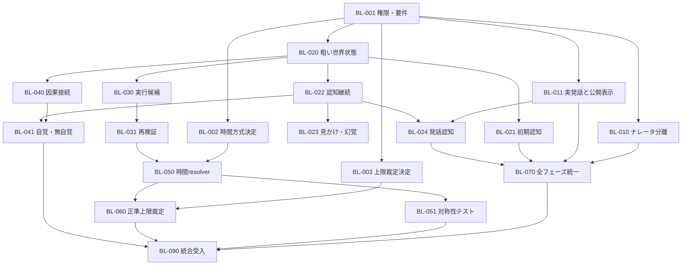

# バトルパイプライン Fit & Gap / バックログ候補

作成日: 2026-08-05
現状スナップショット: `206a1b0fded3054c8f590589ca1316e3cd4cf342` (`origin/HEAD`, `origin/main`, `v0.5.1`)
状態: **Fit / Gap 基準線（実行状態はPERTで管理）**

実行計画: [`battle-fit-gap.pert`](battle-fit-gap.pert)
進捗注記: 基準線の取り違えが判明したため、2026-08-05 に `origin/HEAD` を
fetchして上記SHAへ固定し、ソース調査と正常系テストをやり直した。`T_NARRATOR`
はこの基準線への選択的マージとして再着手する。この文書の Fit / Gap 判定は
上記スナップショット時点に固定し、統合中の実装によって書き換えない。

決定ロック: 勝負がつかない場合は、公開表現を読まない独立した裁定LLMの
生判断（勝者・事実理由）を先に確定し、その裁定と直近の公開ナレーションを
ナレータへ渡してユーザー向けに表現する。公開ナレーションから裁定LLMへの
逆流は禁止する。

時間解決の決定ロック: 2者対戦では `initiative-window-v1` を採用する。
確定済みのターン開始補正を反映した実効速度の差が1以内なら、双方を同一の
開始状態から原子的に解決する。差が2以上なら高速側を先にcommitし、低速側を
commit後の状態で再検証する。同時戦闘不能は引き分け、排他的競合は明示規則が
なければ `contested` とし、Side名や乱数でtie-breakしない。詳細は
[`battle-temporal-resolution.md`](battle-temporal-resolution.md) を参照する。

## 0. この文書の扱い

- 要望は、現在の型・LLM 呼出し回数・既存実装方式に引きずられずに再記載する。
- Fit / Gap の「現状」は、上記 `origin/HEAD` だけを対象とする。
- 統合ブランチ、旧ブランチ、stashにある変更は保持するが、Fit判定の根拠には含めない。
- 本文の候補は `battle-fit-gap.pert` へ計画化済みである。実装の着手・完了は
  PERTのwork eventを正とし、候補の記載だけでは後続タスクの開始を意味しない。
- 座標ベースの厳密な物理シミュレーションは要求しない。

## 1. 要望の再記載

### R-01 ナレータの責務分離

ナレータは、確定済みの事実とキャラクターが実際に発したセリフを、ユーザーへ分かりやすく提示する。ナレータの語り口、視点、創作的表現、失敗、フォールバック結果は、キャラクターの認知・記憶・行動、戦闘効果、時間順序、勝敗へ一切フィードバックしない。

### R-02 セリフの所有権と表示

セリフの内容は、発話キャラクターが自分の記憶・意識・認知可能コンテキストから生成する。ナレータはそのセリフを受け取り、適切な位置へ挿入し、語り方針に沿って表層表現を整えてよい。ただし、話者、事実、意図、肯否、対象、発話行為を変えてはならない。安全に加工できない場合は原文を使う。

キャラクターが実際に発したセリフと、ユーザーへ表示されたセリフは別データとして扱う。公開表示をキャラクター自身の発話記憶へ書き戻さない。

### R-03 セリフも認知対象にする

他キャラクターは、公開画面のセリフではなく、世界内で実際に発生した発話を、距離、遮蔽、騒音、聴覚状態、意識状態、言語理解、幻覚等を通じて認知する。聞こえなかった内容を知ったことにせず、聞き違い・一部認知・話者不明も表現できる。

### R-04 現実的だが粗い世界・状態モデル

厳密な物理モデルは不要だが、少なくとも次の構造化状態をサーバー側の事実として持ち、認知・行動可能性・効果へ反映する。

- 相対位置: 接触、近距離、中距離、遠距離、場外等
- 存在・露出: 同一場面に存在、遮蔽、隠密、不可視、消失、不在等
- 向き・遮蔽・環境: 必要な範囲の正対、背後、障害物、暗さ、騒音等
- 身体・精神・感覚: 戦闘不能、拘束、目隠し、聴覚阻害、混乱、恐怖、幻覚等
- オブジェクト関係: 所有、保持、装着、接触、遮蔽物、使用可能性等

### R-05 初期認知と認知の継続

戦闘開始時に初期世界状態から初期認知を決定する。同じ場に通常の露出状態で対峙している相手は、少なくとも存在・概略位置を認知できる。設定上の面識や名乗り等がなければ、存在を認知しても正体まで自動識別する必要はない。

一度認知した相手への現在アクセスは、LLM が新しい知覚根拠を出さなかったという理由だけでは消えない。隠れる、遮蔽物へ移動する、不可視化する、消える、場外へ出る、観測者が失神する等の構造化された変化がある場合に低下する。識別済みという記憶と、今見えているかは別に保持する。

### R-06 見かけ上の認知

変身、変装、幻覚、偽装等では、正準な実体と観測者が認知している姿・正体を分離する。観測者は誤った見かけを事実だと信じ得るが、その誤認を正準世界の同一性へ上書きしない。

### R-07 キャラクター固有の意思決定

各キャラクターは、次の情報だけから意図とセリフを生成する。

- 自分のプロフィールと能力
- 自分の非公開な記憶・目標・感情・信念
- 自分向けに投影された最新認知
- サーバーが世界状態から算出した、その時点で実行候補になり得る行動

相手の非公開状態、正確な残量、認知できない正体・位置、ナレータ文、他者専用の認知は参照しない。

### R-08 行動の実行可能性

キャラクターが意図した行動でも、世界、場面、位置、状態、資源、対象、オブジェクト関係から実行不能なら、そのまま成功させない。サーバーが実行直前にも検証し、不成立、部分成立、代替、失敗を正準結果として確定する。

### R-09 世界からの自覚・無自覚な干渉

キャラクター、場面、オブジェクト、効果は互いに干渉し、正準な状態・行動可能性・結果へ因果的に反映される。

- 認知できた影響は、認知frameを通じて自覚的な判断材料になり得る。
- 認知できない影響も、行動候補の制約、成功度、状態変化等として働く。
- 無自覚な原因そのものは漏らさず、後から認知可能になった結果だけを認知させてもよい。

### R-10 Side A / Side B の公平な時間解決

Side A 固定先行を廃止する。次のいずれか、または両者を統合した方式を明示的に選ぶ。

1. 完全同時: 同一ターン開始時点から双方の結果を独立計算し、原子的に併合する。
2. 素早さ等による順次処理: Side に依存しないイニシアチブで先後を決め、先行結果を後行へ反映する。
3. イニシアチブ帯: 明確な差は順次、同値または同一帯は同時に解決する。

相討ち、相互妨害、同時移動、先行による後行不能、同値時の競合規則を決め、A/B を入れ替えても同条件なら同じ意味の結果になることを保証する。

### R-11 勝敗の正準性

勝敗は、正準な機械状態と採用済み裁定規則から決定する。上限時に意味的な総合評価が必要でも、評価器はナレータの公開文ではなく正準ターン記録を読む。ナレータの語り口を変えても勝敗は変わらない。

## 2. 目標とする責務・データ境界

```mermaid
flowchart LR
  W0[ターン開始時の正準世界] --> PA[Side A 認知]
  W0 --> PB[Side B 認知]
  MA[Side A 私的記憶] --> CA[Side A キャラ判断]
  MB[Side B 私的記憶] --> CB[Side B キャラ判断]
  PA --> CA
  PB --> CB
  W0 --> FA[Side A 実行候補]
  W0 --> FB[Side B 実行候補]
  FA --> CA
  FB --> CB
  CA --> IA[行動意図 A]
  CB --> IB[行動意図 B]
  CA --> SA[実発話 A]
  CB --> SB[実発話 B]
  IA --> V[実行可能性の再検証]
  IB --> V
  W0 --> V
  V --> T[公平な時間解決]
  T --> W1[確定済み正準世界・イベント]
  SA --> W1
  SB --> W1
  W1 --> PNA[次の Side A 認知]
  W1 --> PNB[次の Side B 認知]
  PNA --> MA
  PNB --> MB
  W1 --> NV[ナレーション用表示 view]
  SA --> NV
  SB --> NV
  NV --> N[ナレータ: 配置・表層加工・説明]
  N --> UI[公開ログ]
```

重要な非経路は次の通り。

- `公開ログ -> キャラ私的記憶` は接続しない。
- `ナレータ -> 正準世界 / 行動 / 勝敗` は接続しない。
- `Side A 認知 -> Side B 判断` および逆方向は接続しない。
- キャラクターへの発話伝達は `実発話 -> 正準イベント -> 観測者別認知` を通す。

| データ | 事実性 / 所有者 | 主な利用者 | 禁止される利用 |
|---|---|---|---|
| 正準世界状態 | サーバーが確定する事実 | 実行可能性、時間解決、知覚投影、勝敗 | キャラへ未投影のまま全量開示 |
| キャラ別認知frame | 正準世界から観測者別に投影 | 対応するキャラだけ | 他 Side への流用、正準世界の上書き |
| 私的記憶・意識 | 各キャラ固有 | 対応するキャラだけ | ナレータ文による上書き |
| 行動意図 | 各キャラの判断結果 | 検証・時間解決 | 未検証のまま正準結果にすること |
| 実発話 | 発話キャラの判断結果 | 発話知覚、ナレータ表示入力 | ナレータが内容を新規決定すること |
| 公開セリフ | 実発話の表示レンダリング | UI | 実発話・私的記憶への書戻し |
| ナレータ文 | 表示専用の説明 | UI | 認知、行動、効果、勝敗の根拠 |
| 勝敗 | 正準状態と裁定規則 | UI、レーティング | 公開ナレーションからの判定 |

## 3. v0.5.1 基準線の要約

現状は、機械解決、セマンティック世界、観測者別知覚、キャラ別の私的状態、ナレーションviewという分離の土台を持つ。一方で、責務の接続方法に要望との不一致がある。

1. 最初の進行は turn 0 のプロローグであり、通常戦闘 turn 1 は次の進行で解決される。
2. 新規戦闘の初期知覚は self 中心の最小frameで、counterpart のアクセスと識別は原則なしで始まる。
3. 通常ターンでは、機械解決、セマンティック更新、知覚投影、A/B キャラエージェント、ナレータの順に処理される。
4. A/B キャラエージェントには別々のframeと私的状態が渡され、次ターン行動と非公開反応サンプルを生成する。
5. 公開セリフはキャラの反応サンプルをソースにせず、ナレータが独自に生成する。
6. ナレータが生成した公開セリフは、キャラの `lastSpeech` へ書き戻される。
7. 通常の戦闘行動は Side A を先に適用し、A の結果でどちらかが戦闘不能なら Side B の行動をスキップする。
8. `spd` は能力値として存在するが、行動順決定には使われていない。
9. 両者戦闘不能を draw とする終了分岐はあるが、通常の A/B 行動を同一開始状態から同時成立させる仕組みはない。
10. 知覚registryの識別知識は保持できるが、現在アクセスは各投影でいったん `none` に戻り、そのターンの知覚根拠から再構築される。
11. セマンティック世界には場面・キャラ・オブジェクト・所在等があるが、相対距離、遮蔽、拘束、感覚阻害等を一貫して行動可否と知覚へ反映するサーバー規則はない。
12. `availableActions` は主に資源・必殺技解禁を判定し、位置・対象・保持物・状態等の世界制約を網羅しない。
13. キャラ意図が使えない場合の既存ポリシー経路は、相手の正確な機械HP比率を条件にできる。
14. 上限判定の審判は、公開ナレータ文の要約を入力として、エンジン仮判定を上書きできる。
15. 既存要件 `F-BTL-05`、`F-BTL-15`、`docs/narration-perspective.md` は、それぞれ LLM 上限判定、ナレータによる公開台詞生成、キャラは公開台詞を所有しない設計を明記しており、今回の要望と要件文書自体が衝突する。

## 4. Fit & Gap

判定基準:

- `Fit`: 要望を満たす責務と主要経路がある。
- `Partial Fit`: 再利用可能な土台はあるが、重要な経路または保証が不足する。
- `Gap`: 要望と逆向きの経路がある、または必要な仕組みがない。
- `Decision Gap`: 実装前にルール選択が必要である。

| 要望 | 判定 | Fit している点 | Gap / リスク |
|---|---|---|---|
| R-01 ナレータ責務分離 | `Gap` | 通常ターンの機械効果はナレーションより前に確定する | 公開セリフを私的 `lastSpeech` へ書戻す。上限判定がナレータ文を読む |
| R-02 セリフ所有権 | `Gap` | キャラエージェントは非公開の `speech` を生成できる | 公開セリフのソースに使わず、ナレータが別内容を生成する |
| R-03 セリフの認知 | `Gap` | 音を扱える汎用知覚根拠はある | 発話イベントと観測者別の聞こえ方を結ぶ契約がない |
| R-04 粗い世界・状態モデル | `Partial Fit` | セマンティック場面、安定IDのentity、location、factsがある | 距離・遮蔽・感覚・精神・拘束等の共通状態と決定論的解決規則がない |
| R-05 初期認知 | `Gap` | self/counterpart の必須slotはある | 新規戦闘が初期 counterpart access `none` で始まり、対峙状態を反映しない |
| R-05 認知継続 | `Partial Fit` | contact ID と識別知識は継続できる | 現在accessを毎回消し、根拠欠落だけで見失い得る |
| R-06 見かけ上の認知 | `Partial Fit` | `perceivedAs` と識別確度の土台はある | 変身・幻覚・偽装の正準原因、見かけ、信念を分ける遷移規則がない |
| R-07 キャラ固有判断 | `Partial Fit` | A/B の私的状態・認知frame・LLM入力は分離される | 代替ポリシーが相手の正確なHP比率を参照でき、初期方針生成も相手公開プロフィールを無条件に受ける |
| R-08 行動実行可能性 | `Partial Fit` | 資源、技ID、必殺技解禁は検証する | 位置、拘束、対象、オブジェクト、場面制約を候補列挙・再検証しない |
| R-09 自覚・無自覚な干渉 | `Partial Fit` | 機械効果、世界差分、観測者別投影を分離できる | セマンティック物体・状態の多くが戦闘可否・効果へ因果接続されていない |
| R-10 公平な時間解決 | `Decision Gap` + `Gap` | `spd` と両者down時のdraw分岐はある | A固定先行。完全同時 / 速度順 / 帯方式の選択と競合規則が未定 |
| R-11 勝敗の正準性 | `Gap` | 戦闘不能はエンジンが判定し、上限時の仮スコアもある | 審判がナレータ文から勝者を上書きできる |
| 全フェーズの一貫性 | `Gap` | 通常ターン用の知覚・ナレーションviewがある | プロローグ、通常ターン、アフターマスでセリフ・認知・表示契約が揃っていない |

### 総評

土台として最も Fit しているのは、正準状態、観測者別frame、キャラ別私的状態、表示viewを分けようとしている点である。主要な Gap は型の不足だけではなく、次の権限逆転にある。

1. 表示担当のナレータが、キャラの公開発話を決め、その結果をキャラ記憶へ返している。
2. 観測根拠の不在を、世界内で見失う原因と同等に扱っている。
3. 世界・場面は記述されるが、行動可能性と結果へ十分に作用しない。
4. 時間解決と上限判定が Side / ナレータ出力に依存し得る。

## 5. バックログ候補

優先度は依存関係上の仮置きであり、着手承認ではない。

| ID | 優先度 | 候補 | 依存 | 完了条件の要約 |
|---|---:|---|---|---|
| BL-001 | P0 | 権限表と要件衝突を承認可能な変更案にする | なし | R-01〜R-11、正準データ所有者、禁止フィードバックを要件IDへ落とし、`F-BTL-05/15` 等の置換案をレビューできる |
| BL-002 | P0 | 時間解決方式を決定する | BL-001 | 完全同時 / 速度順 / イニシアチブ帯から方式を選び、同値、相討ち、妨害、移動競合、後行不能、乱数seedを決める |
| BL-003 | P0 | 上限時の裁定権限と入力を確定する | BL-001 | 独立した裁定LLMが正準事実から生判断し、その不変の裁定を公開ナレーション文脈つきでナレータが表現する二段階契約を記録する |
| BL-010 | P0 | ナレータを純粋な表示境界にする | BL-001 | 語りスタイル、ナレータ応答、失敗を変えても、次の認知・私的状態・行動・効果・勝敗が同じになる |
| BL-011 | P0 | キャラ起点の実発話と公開レンダリングを分離する | BL-001 | キャラが生成した実発話だけが公開セリフソースになり、公開文を私的状態へ書き戻さない。加工不能時は原文を表示する |
| BL-020 | P1 | 粗い位置・存在・状態・関係モデルを定義する | BL-001 | 有限enumと構造化関係で必要状態を表し、厳密座標なしで知覚・実行可能性・効果が同じ事実を参照する |
| BL-021 | P1 | 決定論的な初期認知を生成する | BL-020 | 通常対峙では相互存在・概略位置を認知し、遮蔽等は反映し、根拠なしに正体を漏らさない |
| BL-022 | P1 | 認知accessの継続と明示的喪失遷移を実装する | BL-020 | provider無応答だけではaccessが落ちず、移動・隠密・不可視・感覚喪失等の確定変化でだけ適切に変わる |
| BL-023 | P1 | 変身・幻覚・偽装の見かけモデルを定義する | BL-020, BL-022 | 正準実体、観測された姿、推定正体、確信度、信念を分離し、誤認が正準同一性を変更しない |
| BL-024 | P1 | 実発話を観測者別知覚へ投影する | BL-011, BL-020, BL-022 | 聞こえた範囲、話者帰属、言語理解、歪みを Side 別frameへ反映し、公開表示を知覚入力に使わない |
| BL-030 | P1 | 世界制約から実行候補を算出する | BL-020 | 資源だけでなく位置、状態、対象、保持物、場面制約を反映した observer-safe な候補だけをキャラへ渡す |
| BL-031 | P1 | 意図を正準世界で再検証し、安全にフォールバックする | BL-020, BL-030 | 状態競合後も再検証し、不成立理由・部分成立・代替を確定する。代替選択は認知不能な相手の正確値を読まない |
| BL-040 | P1 | セマンティック世界を機械的因果へ接続する | BL-020 | オブジェクト、場面、状態、効果が対象集合、可否、係数、状態遷移へ構造的に作用する |
| BL-041 | P1 | 自覚 / 無自覚な影響を分離投影する | BL-022, BL-040 | 未認知原因は漏らさず正準効果・制約として作用し、認知可能な結果だけがframeへ現れる |
| BL-050 | P1 | 採用した公平時間resolverを実装する | BL-002, BL-020, BL-031 | Side名非依存の順序 / 同時帯、同一開始snapshot、競合merge、相討ちを一つの規則で解決する |
| BL-051 | P1 | 時間解決の対称性・競合テストを追加する | BL-050 | A/B入替え、同速、速度差、相互KO、相互妨害、後行不能、同時オブジェクト操作を固定fixtureで検証する |
| BL-060 | P1 | 上限裁定を正準ターン記録へ移す | BL-003, BL-050 | ナレータ文を変更・空応答にしても同じ勝敗になり、裁定理由は確定事実に追跡できる |
| BL-070 | P1 | プロローグ / 通常 / アフターマスの契約を統一する | BL-010, BL-011, BL-021, BL-024 | 全フェーズで実発話、認知、表示、禁止フィードバックが同じ原則に従う |
| BL-080 | P2 | 旧BattleState互換と移行方針を決める | BL-020〜BL-024 | 旧戦闘の初期識別・access・発話記憶を、漏えいと不自然な消失なしに読み込める |
| BL-090 | P2 | 統合受入・provider評価・観測性を整備する | BL-010〜BL-080 | mockと実providerで責務境界、非漏えい、現実的認知、A/B対称性、語りスタイル独立性を確認できる |

## 6. P0 候補の受入条件詳細

### BL-001 権限表と要件変更案

- `実発話`、`公開セリフ`、`ナレータ文`を別の用語とデータにする。
- `F-BTL-05` の上限判定、`F-BTL-15` の公開台詞所有者、LLM役割表、論理パイプライン、`docs/narration-perspective.md` の衝突を列挙する。
- 既存要件を黙って読み替えず、置換 / 廃止 / 維持をユーザーが選べる差分にする。
- 要件変更の承認と実装開始の承認を別に扱う。

### BL-002 時間解決方式の判断項目

| 項目 | 完全同時 | 速度順 | イニシアチブ帯 |
|---|---|---|---|
| 相討ち | 自然に成立 | 特例が必要 | 同一帯で成立 |
| `spd` の意味 | 回避等へ限定可能 | 先後へ直接反映 | 帯の決定へ反映 |
| 先行妨害 | 同ターン行動は原則止めない | 後行を止められる | 帯を跨ぐ場合に止められる |
| merge規則 | 多い | 少ないが順序影響が大きい | 両方必要 |
| 公平性説明 | 同一snapshotで明快 | Side非依存式と同値規則が必要 | 同値帯幅とmerge規則が必要 |

現時点の提案は **イニシアチブ帯** である。速度差を意味あるものにしつつ、同値帯では相討ちを通常規則として扱えるため。ただし、これは候補であり決定ではない。

最低限決める項目:

- initiative の構成要素とseed
- 同値または同一帯の定義
- 防御・割込み・状態異常が効く時点
- 同時移動と同一オブジェクト操作の競合
- 同一帯内で一方が戦闘不能になっても、既に成立した他方の意図を適用するか
- 相互戦闘不能時の勝敗

### BL-010 ナレータ独立性

同じ正準入力に対して次だけを変えるメタモルフィックテストを置く。

- 語り口、視点、温度
- ナレータproviderの正常 / timeout / schema不正
- 地の文と公開セリフの表層表現

変化してよいのは公開ログだけであり、認知frame、私的状態、行動意図、機械イベント、正準世界、勝敗、レーティング入力は同一でなければならない。

### BL-011 発話と表示

- キャラ出力は、少なくとも話者、原文、発話行為、対象、事実アンカー、意図を区別できる。
- ナレータ入力へ、正準に採用された実発話を欠落なく渡す。
- ナレータは配置と許容された表層加工だけを返す。新しい発話を追加しない。
- 加工後も話者、肯否、対象、事実、意図が保存されることを構造検証とfixtureで確認する。
- 検証できない加工は破棄し、実発話の原文へ戻す。
- `publicSpeech` は `actualSpeech` やキャラ私的状態を更新しない。

### BL-003 / BL-060 上限裁定

- 入力は、正準な行動、確定効果、状態遷移、戦場への確定影響だけにする。
- 公開ナレータ文、公開セリフ、語り視点を入力から除外する。
- 裁定LLMはナレータとは別ロール・別契約とし、正準事実から勝者と生の理由を先に確定する。
- ナレータは確定裁定と直近の公開ナレーションを受けるが、勝者・理由を変更せず、ユーザー向けの文体と連続性だけを担当する。
- 同一正準記録なら語りスタイルや言い換えにかかわらず同じ勝敗になる。

## 7. 推奨する依存順

## 8. まだ決めない事項

次はバックログ採用時に判断し、現時点では固定しない。

- 完全同時、速度順、イニシアチブ帯の最終選択
- initiative の具体式と同一帯の幅
- 初期設定で双方の名前・正体まで既知とする条件
- セリフの表層加工で許容する範囲と自動検証方法
- 幻覚・変身を汎用effectで表すか専用状態にするか
- 旧戦闘データへ新しい初期認知を遡及するか

## 9. 現状判定の根拠

すべてスナップショット `206a1b0fded3054c8f590589ca1316e3cd4cf342` を `git show` / `git grep` で確認した。shared生成物を同revisionへbuildした後、`npm test`（shared 115、backend 69、frontend 13、deployment 3）と `npm run typecheck` が成功した。作業ツリーの同名ファイルは統合変更を含むため、この節の「現状」とは区別する。

| 根拠 | 確認した内容 |
|---|---|
| `docs/requirements.md` | `F-BTL-05/15/26/34/35/36`、論理ターンパイプライン、LLM役割表 |
| `docs/narration-perspective.md` | キャラは公開台詞を所有せず、ナレータが `speeches[]` を生成する設計 |
| `docs/battle-perception.pert` | `T_CONSUMERS` が未完了であること |
| `packages/shared/src/battle-engine.ts` | 初期最小認知、A固定先行、Bスキップ、上限仮判定、両者down分岐 |
| `packages/shared/src/perception-projection.ts` | 識別知識の継続と、投影ごとのcurrent access再構築 |
| `backend/src/services/battle-service.ts` | キャラ入力分離、限定的available actions、公開セリフの`lastSpeech`書戻し、審判へのナレータ文入力 |
| `backend/src/llm/openai-compatible.ts` | キャラの非公開speechと、ナレータによる独立した公開speech生成 |
