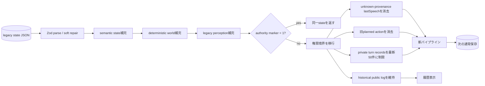

# 旧バトルの権限境界移行

作成日: 2026-08-05
対象: `BL-080`, `T_COMPAT`

`pipelineAuthorityVersion: 1` は、キャラクタの実発話、認知、行動、ナレーションを
分離したパイプラインで作成または移行済みであることを示す。DB列の追加や一括更新は
行わず、旧state JSONを読み込んだ際に決定論的に補完し、次の通常保存で永続化する。

| 旧データ | 読み込み後 | 理由 |
|---|---|---|
| world stateなし | sceneと両キャラクタから決定論的に生成 | LLMで旧文章を再解釈しない |
| perceptionなし | 対戦設定済みの相手をidentifiedかつ現在clearとしてseed | 継続中の既知対戦相手が暗黙に消えない |
| `agentState*.lastSpeech` | `null` | 旧公開ナレータ表現と実発話の由来を判別できない |
| `plannedAction*` | 削除 | 汚染の可能性がある旧発話・認知から選ばれた行動を実行しない |
| private turn records | 最新50件 | 通常ターンと同じ保存上限に合わせる |
| public `log` / narrative blocks | 変更しない | 過去表示を保存するが、認知・行動入力には戻さない |

移行はmarkerがないstateに一度だけ適用され、二回目以降は参照も内容も変更しない。
失敗時に部分保存は行わず、読み込み自体を失敗させる。新フィールドはstate JSON内の
optional fieldであり、旧アプリケーションは未知fieldを読み捨てられる。DB schemaを
変更しないため直前revisionへapplication rollbackできるが、旧revisionで再保存すると
markerが失われ、再度新revisionへ戻した時に同じ決定論的移行が実行される。

公開DTOは明示的projectionで生成され、marker、private agent state、perception registry、
canonical control IDは含まれない。ナレータ文章と公開用に整形した台詞を、移行処理が
private cognitionへコピーする経路もない。
