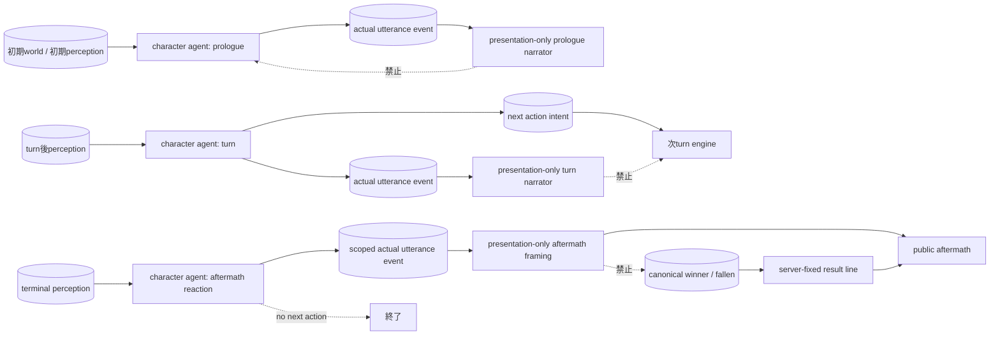

# バトル各フェーズの権限契約

作成日: 2026-08-05
対象: `BL-070`, `T_PHASES`

プロローグ、通常ターン、終局ターン、余波は同じ情報権限を使う。差は、機械行動を
解決するか、character agentが次行動を選ぶかだけである。

| フェーズ | character入力 | next action | actual speech | canonical outcome |
|---|---|---:|---:|---|
| プロローグ | turn 0の初期perceptionと自己profile | 選ぶ | characterが生成してcommit | まだ存在しない |
| 通常・終局turn | commit後のobserver別perception | 戦闘継続時に選ぶ | characterが生成してcommit | engineが決定 |
| 余波 | 終局perceptionと自己profile | 選ばない | reaction-onlyで生成し、物理的に可能ならcommit | engine結果をserver固定文として挿入 |

余波ナレータは `before` / `after` の雰囲気と、渡された実発話の配置だけを返す。
参加者名や勝敗・回復・復活等を含む結果主張はframingから除去され、勝者、脱落者、
引き分けは正準stateからserverが一行だけ生成する。ナレータが追加した発話は
`finalizeCharacterSpeeches` で除去し、character sourceと事実が一致する行だけを
公開する。
