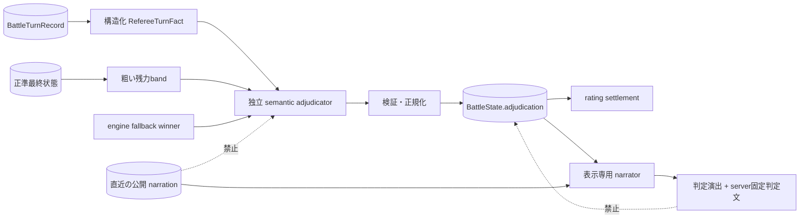

# ターン上限時の勝敗裁定契約

作成日: 2026-08-05
対象: `BL-060`, `T_ADJUDICATION`

ターン上限で決着しなかった場合だけ、機械解決とは独立した semantic
adjudicator が正準記録を評価する。通常の戦闘不能・相討ちは時間解決の結果を
そのまま採用し、この裁定経路を通さない。

## 入出力境界

| データ | 裁定入力 | ナレータ入力 | 正準結果への権限 |
|---|---:|---:|---:|
| 実行・skip済みactionと再検証理由 | 可 | 不要 | 参照のみ |
| 構造化effect、戦闘継続可否、world operation種別 | 可 | 不要 | 参照のみ |
| 粗いHP/MP/stamina残力band | 可 | 不要 | 参照のみ |
| engine暫定winner | fallbackとして可 | 不要 | provider失敗時のみ採用 |
| 公開ナレーション、event summary、公開・実発話本文 | 不可 | 直近公開文のみ可 | なし |
| 検証済み`adjudication` | 出力 | 必須 | winner・reasonを変更不可 |

`adjudication` は winner、事実理由、理由factor、入力turn範囲、fallback値、
裁定sourceを保持する。ナレータはその後に雰囲気を前後へ付加できるが、serverが
正準winnerとreasonから作る判定文を置換・言い換えできない。ナレータtimeout、
空応答、style変更は表示上の前後文だけを変え、winner、finish reason、rating、
reason factsを変えない。
