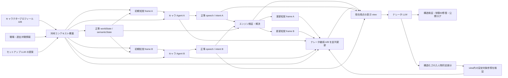

# 戦闘内の呼称・認知・ナレータ継続状態

## 目的

戦闘開始時に、戦場・キャラクタープロフィール・過去対戦情報から、その戦闘だけで固定する対峙コンテキストを作る。キャラクターの認知と、ユーザーへ見せるナレータ上の呼称は別の状態として扱い、可変視点でも A 視点・B 視点の継続状態を毎ターン更新する。

## 権限境界

- 正準の話者 Side、worldState、知覚 frame、勝敗はサーバーが所有する。
- セットアップ LLM は短い戦闘内ラベル、関係性、相互の呼称、一人称候補、導入要約を提案できる。サーバーは長さ、衝突、プロフィール整合性を検証し、失敗時は決定論的既定値へ戻す。
- キャラクター LLM が返す A/B の発話本文が正準 speech であり、ナレータ LLM はその表示位置、事実不変の表層加工、現在の語り視点が知りうる情報に基づく表示話者ラベルを自由に構成する。ラベル内容をサーバー側の候補集合で再判定しない。
- 場面状態が第三者または場面 entity の存在と能動性を支える場合、ナレータは source Side を持たない表示専用の発話・反応を構成できる。これは正準 utterance event、キャラクター認知、worldState へ逆流せず、機械的な影響が必要な発話はナレーションより前に正準 event として確定する。
- ナレータ継続状態は表示専用であり、キャラクターの記憶や現在知覚へ書き戻さない。
- ナレータ人物同定は安定対象参照と分離して視点別に保持する。`identified + same_entity`の対象は一時的な遮蔽、声だけの知覚、ターン変更、表示視点切替で未知へ戻さない。ナレータは既存の同じ応答で認識差分を返し、追加の LLM 呼び出しは行わない。
- 内面状態は結論だけを有界に保存し、逐語的な思考過程は要求・保存・公開しない。

## 先頭ターン DFD

## データ一覧

| データ | 生成元 | 利用先 | 永続化 | 制約 |
|---|---|---|---|---|
| `encounterContext` | セットアップ提案 + サーバー検証 | 初期認知、キャラ Agent、プロローグ、呼称 | 戦闘単位 | 戦闘開始後は固定。正式表示名と短縮ラベルを分離 |
| `perceptionFrameA/B` | worldState + observer 別 evidence | 各キャラ Agent、視点別ナレータ view | 最新のみ | current access と identity memory を分離 |
| `agentStateA/B` | 各キャラ Agent | 次ターンの同じキャラ、許可された内面 digest | 有界 | 他 Side と公開ログから隔離。逐語思考を保存しない |
| 正準 speech | 各キャラ Agent + サーバー成立検証 | 相手の発話知覚、ナレータ | turn record | source Side と本文をナレータが変更しない |
| `narratorContinuity.a/b` | 各 frame + 各 agent の結論状態 | 対応する主観 view | 最新・有界 | 選択視点にかかわらず両方更新。キャラ認知へ逆流しない |
| `narratorContinuity.reader` | 対峙コンテキスト + 公開済み情報 | すべての表示 view | 最新・有界 | 読者既知とキャラ既知を混同しない |
| ナレータ人物同定 | コンテキスト生成処理 + 既存ナレータ応答内の認識差分 | 次ターンの同じ視点のナレータview | 視点ごと・最大16件 | 安定対象参照、認識名、identity knowledge、同一性、最終確認turnを保持。`same_entity`の既知名は一時的知覚低下で消さない |
| 表示話者ラベル | 視点別view + observer-localな表示コンテキスト + ナレータ | 公開ログ | 公開 NarrativeBlock | ラベル内容は再フィルタしない。空・過長・制御ID等の構造だけ修復し、正準情報へ書き戻さない |
| 場面由来の発話・反応 | 視点別view内で存在と能動性が支えられる第三者・場面entity + ナレータ | 公開ログ | 公開 NarrativeBlock | source Sideなしの表示専用。キャラ認知・正準event・worldStateへ書き戻さない |

## 互換性

既存戦闘に新状態がない場合、保存済み表示名、知覚 frame、agent state から決定論的な対峙コンテキストと A/B 継続状態を生成する。既存の公開文をキャラクター記憶へ変換せず、次回保存時から新形式を保持する。
