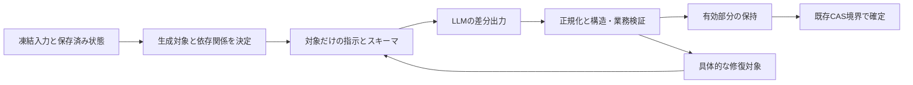

# 動的な顕在出力契約の詳細設計

2026-10-03。所有者の「その時足りない・修正・更新が必要な情報だけを出力させる」方向に基づく設計。実装・既存試合の変更・provider実行・デプロイは含まない。

関連: [ADR-0047案](adr/0047-phase-scoped-conscious-output-and-mechanical-completion.md)、[責務とフィールド再精査](conscious-server-responsibility-proposal-2026-10-03.md)、[欠落RCA](conscious-required-fields-rca-2026-10-03.think)。本書は前案のフェーズ分割を、生成対象ごとの契約へ具体化する。LLMTHINK正本はADR-0047の.think。

## 1. 中心となる処理

サーバーが今回の生成対象を表す GenerationPlan を構成し、同じplanからプロンプト、provider出力スキーマ、受信正規化、検証、差分適用を作る。LLMがスキーマ・phase・状態の所有権を選ばない。内部のGenerationPlanはモデル出力に含めない。

「状態の不足」「サーバーが予約したphaseに必要な新判断」「検証で特定した修正」のみが対象選択の根拠。自然文の意味分類、語句・類似度による戦術推定で生成対象を増減しない。

## 2. 型付きの構成部品

実装時に以下をclosedな判別ユニオンとして定義する。任意のJSON pointerを生成・代入する仕組みにはしない。

| 部品 | モデルが生成する情報 | 主な適用条件 |
| --- | --- | --- |
| initial_goal | statementと根拠キー | 保存目標が未確定 |
| decision | intentとactionの組 | 通常の新判断、later、選択を変える修復 |
| speech | 新しい発言または提案なし | prologue/turn/aftermathの表現枠が未確定 |
| manifestation | 準備済み候補の選択または提案なし | 表現枠が未確定で候補が存在 |
| action_payload_repair | 既に選択された行動の不足内容 | choiceと型・参照の同一性が保持できる構造修復 |

GenerationPlanのサーバー内部情報は、契約版、phase、側、既存revision/フェンス、凍結入力identity、候補表、出力対象、必須性、依存部品、更新を許す部品、保持する部品、修復回数とする。モデルに返させる必要はない。

型の基本形は「目標未確定/確定」「通常/later/aftermath」「初回/修復」の有限分岐。各分岐から、許可された部品の組だけを組み立てる。自由なRecordにして最後にcastする方法を採らない。

## 3. 対象を決める規則

| 現在の条件 | planに追加する対象 | 保持する情報 |
| --- | --- | --- |
| prologue/turn、目標未確定 | initial_goal、decision、未確定の任意表現 | 自己/観測/規範/候補の凍結入力 |
| prologue/turn、目標確定 | decision、未確定の任意表現 | 確定目標 |
| later、目標確定 | decisionのみ、具体的行動必須 | 目標と成立済み表現 |
| later、目標未確定 | 新しいlaterをdispatchしない | 先行初期化の未解決状態。既存のphase処理規則へ戻す |
| aftermath | 未確定の任意表現だけ | 勝敗・終了理由・確定済み行動 |
| 表現候補なし | manifestationを追加しない | 発現を勝手に選択/生成しない |
| 対象が空 | providerを呼ばない | 既存確定情報をそのまま使用 |

通常のdecisionではintentとactionがともに省略/nullなら新提案なし。保存されたlatestDecisionは記憶として残すが、今回採用された判断という記録は作らない。intentのみ有効、actionなしの判断は既存の発言主体の提案を維持する。actionあり、intentなしは依存情報の欠落。laterでは両方必要で、action:nullを成功にしない。

「通常の更新が必要」は各通常判断枠の発生という機械的条件である。前の判断があるから全通常判断をskipする設計ではない。

## 4. プロンプトとAPIスキーマ

共通指示は、観測範囲と凍結情報のみを使用、目的/選択の意味をモデルが判断、狙いと実行結果を区別、今回の対象だけを返す、という短い原則に限定する。初期目標導出、later再選択、after­mathの説明は該当planだけに付ける。

部品定義から出力プロパティと値域を構成する。initial_goalが対象外ならinitialGoalをスキーマにもプロンプトにも載せない。speechだけの修復ならintent/action/目標の定義を出力スキーマへ載せない。ただし意味判断に必要な許可済み背景情報は提供する。

初期目標と意図は短い意味内容と根拠キーを持つ。rationaleの毎回必須は廃止する案を継続し、理由の定型文を補わない。候補と根拠は短いキーに対応内容を併記し、JSON pointerをモデルに辿らせない。重複したプロフィール自由文や別フェーズの規則は再掲しない。必須規範・情報境界は保持する。

APIスキーマはproviderごとの実装済み/検証済み制約に合わせてコンパイルする。optionalを使える場合はoptional、要求される場合は対象フィールドのみnullableとする。未対応なら黙ってjson_objectへ降格せず、能力不一致としてdispatch前に検出する。strict schemaの対応確認は実装時の独立した条件であり、現行adapterのスキーマグラフ検査だけで実サービスの対応済みとはみなさない。

## 5. 行動表と機械的復元

今回合法な完成済み行動と、意味内容を追加生成する必要のある能力を別の型で用意する。

- 完成済み行動: choiceKeyから今回の束縛済みIntentを復元。LLMにskillId等を転記させない。
- 自由行動能力: choiceKeyと、生成元によるdescription/対象/任意desiredOutcome等が必要。
- reflect能力: choiceKeyと生成元による分析/指針が必要。

キーは今回の凍結候補表への完全一致の参照である。サーバーが新しい意図を決めることではない。候補表の項目を勝手に別の技へ置換しない。利用可能性は既存の権威ある評価関数で準備し、最終の実行境界でも確認する。

スキルや機械的行動でLLMが指定可能な追加選択（finisher、instrument等）があれば、それぞれの合法選択を型付き候補/追加フィールドとして提示する。候補表に記録されていない追加値を機械的復元で消したり、黙ってdefaultへ変えたりしない。表のサイズは入力予算内に制限し、予算超過で規範を削らない。

## 6. 正規化と差分適用

対象フィールドごとに、値の状態を omitted / explicit_null / provided_valid / provided_invalid として診断する。許可された任意フィールドのomittedとexplicit_nullは内部の「新提案なし」へ正規化する。非null不正、未初期化目標欠落、later必須判断欠落をnullへ丸めない。

トップレベルの各部品を型付きでデコードし、独立した有効部品を保持する。未知キー・対象外キーは診断し、そこへの書込みを拒否する。JSON非object等の形状不正は全体不正。未知キーがあっても、既知の独立部品を救済するかは下記の閉じた部品境界で扱う。部品内の余分なキーはその部品を拒否し、文字列名の誤記を自動修正しない。

差分は一般的なJSON Patchではなく、planが許した各部品の専用関数で適用する。omittedは修復対象の既存有効値を消さない。nullは「提案なし」を許す未確定部品にのみ適用し、目標削除や成立済み発話の撤回に使えない。今回のplan外にある既存値は変更不可。

## 7. 依存関係と再試行

依存は意味の推測ではなく型付き規則として定義する。

| 失敗 | 修復対象 | 保持できる部品 |
| --- | --- | --- |
| 初期目標の欠落/不正 | initial_goal。目標未確定のdecisionは採用保留 | 独立した有効表現 |
| 新しい目標案を選び直す | initial_goalとdecision | 独立した有効表現 |
| 初期目標の同じ内容を保つ構造修正 | initial_goal。修正後に保留decisionを再検証 | 独立した有効表現 |
| intent欠落/無効根拠 | decision（intentとactionの組） | 確定目標と独立表現 |
| actionが現在候補にない/選択変更 | decision | 確定目標と独立表現 |
| 選択を固定できる行動payloadの構造不正 | action_payload_repair | 同じchoiceに束縛された有効intentと独立表現 |
| 発言だけ不正 | speechのみ | 有効な目標/decision/発現 |
| 発現だけ不正 | manifestationのみ | 有効な目標/decision/発言 |

「同じ内容」は自然文の意味比較で判定しない。サーバーが保持する提供済み値を変更禁止として、欠落した既知の構造スロットだけを生成するplanで保証する。保留decisionが初期目標に依存する場合、目標statementの変更を許す修復はdecisionも対象とする。保留を採用済みと呼ばない。

自由行動等のpayload修復でchoice変更が必要なら、専用修復のスキーマでは変更させず未解決として扱う。構造情報だけで同一性と依存を保証できないケースは初めからdecisionの組で修復する。

修復入力は、前回の許可済み応答、error path/code、期待型、実際の不正値、allowed choices/根拠と対応内容、保持する部品、今回の修正対象とする。短い指示で「今回の対象だけを返す」を示す。誤りをモデル自身に探させる長い再掲や思考説明は要求しない。

修復応答のスキーマもこの修復planだけから生成する。モデルは対象外の有効部分を再出力しない。壊れたJSONを文字列から部分抽出せず、型付き情報を復元できないときは必要な部品全体を再生成する。

修復は一つの論理判断につき最大1回を設計値とする。HTTP再試行・provider切替で予算をリセットしない。同じ入力・候補表を使用し、修復結果も同じ業務検証に通す。修復上限後は未解決の理由を残し、既存の決定論的処理を独立した由来で扱う。旧意図をfallbackの理由として捏造しない。

## 8. 永続化・再開・可視性

モデルcallは既存のprovider会計に記録し、初回と修復の関係・契約identity・失敗理由を追跡可能にする。新しいledger基盤を追加する案ではなく、既存の判断/継続/呼び出し記録へ必要な型付き情報を持たせる。

有効部分の保持はまず今回判断のstaging内で行い、既存のphase-owned CAS境界で確定する。公開発話を修復待ち中に再発行しない。すでに確定済み部品は修復の適用対象外。

途中再開でアプリケーション修復の上限が増えないよう、論理判断identityと修復予算の予約をprovider呼び出し前に既存の継続保存境界へ記録する。provider呼び出しが曖昧に終了しても予約を未使用に戻さない。新しいモデル呼び出しを再開時に行うなら同じ予算に計上する。

フェンス/CAS基準が変わった結果は適用しない。通常のphase再開規則と凍結状態を再確認し、古い結果を新候補表へ移植しない。API利用記録は消さない。

私的な目標・意図・修復内容を公開ナレーションへ混入させない。入力/応答全体を通常ログへ出さず、フィールド名・検証コード・非秘密identity・集計値を診断に使う。

## 9. 版と互換性

新しい顕在出力契約と意図保存契約を別途版付けし、battle作成時の凍結tupleへ含める。asset manifestの既存schemaVersion=4を顕在出力の新しい版番号と混同しない。新規試合に新契約を明示して適用し、旧decoderと旧記録のrationale等を保持する。

既存試合へ動的decoderを黙って適用しない。継続試合の移行を行うなら対象・snapshot・retry履歴・rollbackを別途決定する。表示用DTOにモデルの私的出力スキーマをそのまま露出しない。

## 10. 実装順序と完了条件

設計成果は本書、ADR-0047案、LLMTHINK監査。今回実装を行わない。実装開始前に承認済みの具体的契約と正本PERTのscope/dependencies/completionを整合させる。旧CA計画やPERT nextを今回の実行権限として流用しない。

| 作業 | 依存 | 完了条件 |
| --- | --- | --- |
| DY1 契約部品と生成対象 | 設計確定 | 不可能なphase/部品の組を型と実行時の両方で拒否 |
| DY2 スキーマ・指示・正規化 | DY1 | 同一planから生成。対象外キーなし、欠落/nullの規則が一致 |
| DY3 候補表と復元 | DY1 | 機械的行動の完全復元、自由行動/reflect内容の非捏造 |
| DY4 差分修復と継続 | DY2, DY3 | 依存閉包、1回上限、再開時予算保持、CAS、独立表現の保護 |
| DY5 保存契約と互換 | DY1, DY4 | 新規tuple固定、旧記録/decoder継続、診断理由の保持 |
| DY6 実証 | DY2〜DY5 | 下記検証を満たす。実モデル比較は実施範囲を別途固定 |

必須検証: 目標有無×phase×表現候補有無×初回/修復、空planでcall無し、未知キー/不正値/必須欠落、nullで確定値を消せないこと、候補更新と古いキー、自由行動の内容保持、修復で対象外値を変更できないこと、初期目標変更にdecision修復が伴うこと、途中再開で修復回数が増えないこと、負け/終了の確定情報がモデルから書換えられないこと。

負担と品質は、入力/出力トークン、call数、修復率、採用率、待機と行動反復、自由行動成立、発言反復、遅延で比較する。予測の改善幅を実測結果として報告しない。全目標をサーバーが固定する方法や意味のパターン分岐を導入して合格させない。
