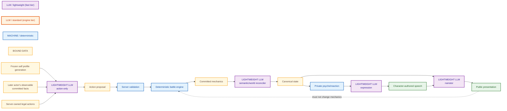
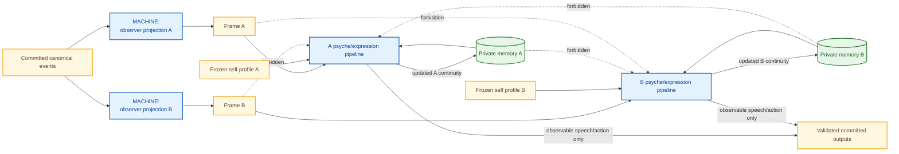

# Current battle pipeline

Updated: 2026-08-12

This document diagrams the currently implemented battle pipeline. It does not
present the accepted but not-yet-implemented narration API separation as current
behavior.

## Normal combat turn

```mermaid
flowchart TD
    LEGEND_LLM_LIGHT["LLM / lightweight (fast tier)"]
    LEGEND_LLM_STANDARD["LLM / standard (engine tier)"]
    LEGEND_MACHINE["MACHINE / deterministic"]
    LEGEND_STORE[("PERSISTENCE")]
    LEGEND_CONTROL["API / control"]

    API["POST advance<br/>Acquire battle lease"] --> LOAD["Load BattleState<br/>and frozen asset generations"]

    LOAD --> PHASE{"Special phase?"}
    PHASE -->|prologuePending| PROLOGUE["Prologue<br/>character agents → narration"]
    PHASE -->|aftermathPending| AFTERMATH["Aftermath<br/>character agents → narration"]
    PHASE -->|normal turn| ENV{"Environment proposal due?"}

    ENV -->|yes| ENV_LLM["LIGHTWEIGHT LLM: proposeHappening<br/>proposal only"]
    ENV -->|no| ORDER
    ENV_LLM --> ORDER

    ORDER["Calculate initiative<br/>select first and later actor"]
    ORDER --> ORDER_SAVE[("Persist causalExecution<br/>order and draw basis")]

    ORDER_SAVE --> FIRST_RESERVED["Read first actor's<br/>previously reserved action"]
    FIRST_RESERVED --> FIRST_ENGINE["Engine<br/>resolve first bucket"]
    FIRST_ENGINE --> FIRST_COMMIT[("Persist first-bucket mechanics<br/>causalBucketCommit<br/>engineContinuation")]

    FIRST_COMMIT --> PROJECT["Build later actor projection<br/>committed events<br/>quantized mechanics<br/>observer-relative facts"]
    PROJECT --> LATER_ACTION["LIGHTWEIGHT LLM: decideCharacterAction<br/>action-only context"]
    LATER_ACTION --> VALIDATE{"Server validation"}
    VALIDATE -->|valid| ACCEPT["Accept proposal"]
    VALIDATE -->|invalid or failure| FALLBACK["Deterministic fallback"]
    ACCEPT --> DECISION_SAVE
    FALLBACK --> DECISION_SAVE

    DECISION_SAVE[("Persist later-decision receipt<br/>provider, model, latency,<br/>validation and fallback reason")]
    DECISION_SAVE --> SECOND_ENGINE["Engine<br/>resolve later bucket<br/>without replaying predecessor"]

    SECOND_ENGINE --> FREE{"Free action present?"}
    FREE -->|yes| FREE_LLM["LIGHTWEIGHT LLM:<br/>batched free-action adjudication"]
    FREE -->|no| SEMANTIC
    FREE_LLM --> FREE_VALIDATE["Server validation<br/>and canonical application"]
    FREE_VALIDATE --> SEMANTIC

    SEMANTIC["LIGHTWEIGHT LLM:<br/>semantic/world reconciliation<br/>and sensory evidence"]
    SEMANTIC --> CANONICAL["Server validation<br/>update semanticState and worldState"]

    CANONICAL --> PSYCHE["Deep-psyche/internal reaction update<br/>normal turn: deterministic lightweight policy"]
    PSYCHE --> EXPRESSION["LIGHTWEIGHT LLM:<br/>advanceCharacterAgent A/B<br/>expression and next-turn proposal"]
    EXPRESSION --> RECORD[("Persist turn record,<br/>perception and character speech")]

    RECORD --> FOCUS{"Narration focus choice needed?"}
    FOCUS -->|yes| FOCUS_LLM["LIGHTWEIGHT LLM:<br/>chooseNarrationFocus"]
    FOCUS -->|no| NARRATE
    FOCUS_LLM --> NARRATE

    NARRATE["LIGHTWEIGHT LLM: narrateTurn<br/>currently synchronous inside advance<br/>streams through advance SSE"]
    NARRATE --> NARRATOR_WRITE["Build public log<br/>update narrator recognition continuity"]
    NARRATOR_WRITE --> TURN_LIMIT{"Turn-limit terminal?"}
    TURN_LIMIT -->|yes| REFEREE["STANDARD LLM: referee<br/>engine tier; may currently select winner"]
    REFEREE --> JUDGMENT["LIGHTWEIGHT LLM:<br/>narrateJudgment"]
    JUDGMENT --> FINAL
    TURN_LIMIT -->|no| FINAL[("Save final BattleState")]
    FINAL --> RESPONSE["Return advance response"]

    PROLOGUE --> RESPONSE
    AFTERMATH --> RESPONSE

    classDef llmLight fill:#f3e5f5,stroke:#7b1fa2,stroke-width:2px,color:#311b92;
    classDef llmStandard fill:#fff3e0,stroke:#e65100,stroke-width:3px,color:#bf360c;
    classDef machine fill:#e3f2fd,stroke:#1565c0,stroke-width:2px,color:#0d47a1;
    classDef store fill:#e8f5e9,stroke:#2e7d32,stroke-width:2px,color:#1b5e20;
    classDef control fill:#f5f5f5,stroke:#616161,stroke-width:2px,color:#212121;

    class LEGEND_LLM_LIGHT,ENV_LLM,LATER_ACTION,FREE_LLM,SEMANTIC,EXPRESSION,FOCUS_LLM,NARRATE,JUDGMENT llmLight;
    class LEGEND_LLM_STANDARD,REFEREE llmStandard;
    class LEGEND_MACHINE,ORDER,FIRST_RESERVED,FIRST_ENGINE,PROJECT,VALIDATE,ACCEPT,FALLBACK,SECOND_ENGINE,FREE_VALIDATE,CANONICAL,PSYCHE,NARRATOR_WRITE machine;
    class LEGEND_STORE,ORDER_SAVE,FIRST_COMMIT,DECISION_SAVE,RECORD,FINAL store;
    class LEGEND_CONTROL,API,LOAD,PHASE,ENV,FREE,FOCUS,TURN_LIMIT,RESPONSE,PROLOGUE,AFTERMATH control;
```

## Context and authority boundaries

## Current implementation boundaries

- Ordinary character actions use two sequential buckets; implicit simultaneous
  character-action buckets are not used by the current ruleset.
- The later actor decides after the first bucket mechanics have been committed.
- The later action call does not receive conversation history, expression
  guidance, or the counterpart's private psyche.
- LLM-authored semantic/world reconciliation still runs after both action
  buckets. The later actor therefore sees committed mechanics and the existing
  canonical world, not a newly LLM-interpreted intermediate world patch.
- Narration is still executed synchronously inside `advance`. ADR-0002's
  independent narration job and API have been accepted but are not implemented.
- Initiative is currently selected during that turn's `advance`; the complete
  future turn-boundary reservation design is not yet implemented.
- Durable duplicate-call prevention and SSE replay hardening remain subsequent
  work.

## Data-flow view: state and memory

The following is a DFD-style view. Cylinders are durable stores. Rectangles are
processes. Yellow nodes are bounded data transferred between processes; they are
not additional sources of truth.

```mermaid
flowchart LR
    CLIENT["External entity:<br/>battle client"]
    PROVIDER["External entity:<br/>LLM provider"]

    ASSETS[("D1 IMMUTABLE GENERATIONS<br/>character A/B snapshots<br/>battlefield<br/>narration style<br/>dialogue/rules policy")]
    CANONICAL[("D2 CANONICAL BATTLE STATE<br/>combatants and parameters<br/>turn/status/winner<br/>semanticState<br/>worldState<br/>supervisor/drama")]
    PRIVATE_A[("D3-A PRIVATE MEMORY<br/>agentStateA<br/>interior/reaction<br/>battleVolatileMemory<br/>conversationHistory")]
    PRIVATE_B[("D3-B PRIVATE MEMORY<br/>agentStateB<br/>interior/reaction<br/>battleVolatileMemory<br/>conversationHistory")]
    PERCEPTION[("D4 OBSERVER STATE<br/>perceptionFrameA/B<br/>private registry A/B<br/>public observation")]
    CHECKPOINT[("D5 RESTART CHECKPOINT<br/>causalExecution<br/>causalBucketCommit<br/>engineContinuation<br/>laterDecision receipt")]
    RECORDS[("D6 TURN RECORDS / TRACE<br/>actions and events<br/>causal/canonical receipts<br/>bounded pipeline trace")]
    PUBLIC[("D7 PRESENTATION STATE<br/>public battle log<br/>character speeches<br/>narrator continuity")]

    CLIENT -->|"advance request + idempotency key"| ORCHESTRATOR["MACHINE: advance orchestration<br/>lease and phase control"]
    ASSETS -->|"frozen generation snapshots"| ORCHESTRATOR
    CANONICAL -->|"current canonical snapshot"| ORCHESTRATOR
    CHECKPOINT -->|"resume position, if present"| ORCHESTRATOR

    ORCHESTRATOR --> ORDER["MACHINE: initiative/order"]
    ORDER -->|"order and draw receipt"| CHECKPOINT
    ORDER --> ENGINE1["MACHINE: first-bucket engine"]
    CANONICAL -->|"turn-start mechanics/world"| ENGINE1
    ENGINE1 -->|"committed mechanics + continuation"| CHECKPOINT
    ENGINE1 --> BOUNDARY["BOUND DATA:<br/>committed boundary snapshot"]

    BOUNDARY --> PROJECTION["MACHINE: later-observer projection"]
    PERCEPTION -->|"later side's previous frame/registry"| PROJECTION
    PROJECTION --> LATER_INPUT["BOUND DATA:<br/>self profile + own frame<br/>+ legal actions"]
    ASSETS -->|"later actor self profile only"| LATER_INPUT
    LATER_INPUT --> ACTION_LLM["LIGHTWEIGHT LLM:<br/>later action decision"]
    ACTION_LLM -->|"action proposal"| PROVIDER
    PROVIDER -->|"action JSON"| ACTION_LLM
    ACTION_LLM --> VALIDATE["MACHINE: schema, legality<br/>and fallback validation"]
    VALIDATE -->|"accepted action + privacy-safe receipt"| CHECKPOINT
    VALIDATE --> ENGINE2["MACHINE: later-bucket engine"]
    CHECKPOINT -->|"engine continuation"| ENGINE2
    ENGINE2 -->|"resolved canonical mechanics"| CANONICAL

    ENGINE2 --> RECON_INPUT["BOUND DATA:<br/>committed actions/events<br/>quantized mechanics<br/>current semantic/world"]
    CANONICAL --> RECON_INPUT
    RECON_INPUT --> RECON_LLM["LIGHTWEIGHT LLM:<br/>semantic/world proposal"]
    RECON_LLM --> PROVIDER
    PROVIDER -->|"patch + sensory proposal"| RECON_LLM
    RECON_LLM --> RECON_VALIDATE["MACHINE: validate and apply<br/>canonical transition"]
    RECON_VALIDATE -->|"accepted semantic/world transition"| CANONICAL
    RECON_VALIDATE -->|"observer-relative projections"| PERCEPTION

    CANONICAL --> PSYCHE_A["MACHINE: deterministic<br/>psyche reaction A"]
    CANONICAL --> PSYCHE_B["MACHINE: deterministic<br/>psyche reaction B"]
    PRIVATE_A --> PSYCHE_A
    PRIVATE_B --> PSYCHE_B
    PERCEPTION -->|"frame A only"| PSYCHE_A
    PERCEPTION -->|"frame B only"| PSYCHE_B
    PSYCHE_A -->|"updated private reaction"| PRIVATE_A
    PSYCHE_B -->|"updated private reaction"| PRIVATE_B

    PRIVATE_A --> EXPR_A_INPUT["BOUND DATA A:<br/>own psyche + frame A<br/>separate expression context"]
    PRIVATE_B --> EXPR_B_INPUT["BOUND DATA B:<br/>own psyche + frame B<br/>separate expression context"]
    PERCEPTION --> EXPR_A_INPUT
    PERCEPTION --> EXPR_B_INPUT
    ASSETS -->|"self profile A"| EXPR_A_INPUT
    ASSETS -->|"self profile B"| EXPR_B_INPUT
    EXPR_A_INPUT --> EXPR_A["LIGHTWEIGHT LLM:<br/>expression A"]
    EXPR_B_INPUT --> EXPR_B["LIGHTWEIGHT LLM:<br/>expression B"]
    EXPR_A --> PROVIDER
    EXPR_B --> PROVIDER
    PROVIDER -->|"speech/action proposal A"| EXPR_A
    PROVIDER -->|"speech/action proposal B"| EXPR_B
    EXPR_A -->|"accepted own continuity"| PRIVATE_A
    EXPR_B -->|"accepted own continuity"| PRIVATE_B
    EXPR_A -->|"validated next action reservation"| CANONICAL
    EXPR_B -->|"validated next action reservation"| CANONICAL
    EXPR_A -->|"committed observable speech"| RECORDS
    EXPR_B -->|"committed observable speech"| RECORDS

    CANONICAL --> NARRATION_VIEW["BOUND DATA:<br/>observer-safe narration view"]
    PERCEPTION --> NARRATION_VIEW
    RECORDS -->|"committed actions/events/speeches"| NARRATION_VIEW
    ASSETS -->|"frozen narration-style generation"| NARRATION_VIEW
    PUBLIC -->|"bounded recent presentation"| NARRATION_VIEW
    NARRATION_VIEW --> NARRATOR["LIGHTWEIGHT LLM:<br/>narration"]
    NARRATOR --> PROVIDER
    PROVIDER -->|"narrator output/progress"| NARRATOR
    NARRATOR -->|"validated public block"| PUBLIC
    NARRATOR -->|"bounded pipeline trace"| RECORDS

    CANONICAL --> SAVE["MACHINE: final validated save"]
    PRIVATE_A --> SAVE
    PRIVATE_B --> SAVE
    PERCEPTION --> SAVE
    CHECKPOINT --> SAVE
    RECORDS --> SAVE
    PUBLIC --> SAVE
    SAVE -->|"public projection only"| CLIENT

    classDef llmLight fill:#f3e5f5,stroke:#7b1fa2,stroke-width:2px,color:#311b92;
    classDef llmStandard fill:#fff3e0,stroke:#e65100,stroke-width:3px,color:#bf360c;
    classDef machine fill:#e3f2fd,stroke:#1565c0,stroke-width:2px,color:#0d47a1;
    classDef store fill:#e8f5e9,stroke:#2e7d32,stroke-width:2px,color:#1b5e20;
    classDef data fill:#fff8e1,stroke:#f9a825,stroke-width:2px,color:#5d4037;
    classDef external fill:#f5f5f5,stroke:#616161,stroke-width:2px,color:#212121;

    class ACTION_LLM,RECON_LLM,EXPR_A,EXPR_B,NARRATOR llmLight;
    class ORCHESTRATOR,ORDER,ENGINE1,PROJECTION,VALIDATE,ENGINE2,RECON_VALIDATE,PSYCHE_A,PSYCHE_B,SAVE machine;
    class ASSETS,CANONICAL,PRIVATE_A,PRIVATE_B,PERCEPTION,CHECKPOINT,RECORDS,PUBLIC store;
    class BOUNDARY,LATER_INPUT,RECON_INPUT,EXPR_A_INPUT,EXPR_B_INPUT,NARRATION_VIEW data;
    class CLIENT,PROVIDER external;
```

### State lifetime and authority

| Data class | Lifetime | Authoritative writer | LLM visibility | Public visibility |
| --- | --- | --- | --- | --- |
| Frozen asset generations | Entire battle | Battle setup/generation binding | Only the responsibility-specific projection | Public-safe snapshot fields only |
| Canonical mechanics | Entire battle | Deterministic engine and validated server transitions | Qualitative/bounded projection; raw opponent-private values are excluded | Public battle projection only |
| `semanticState` / `worldState` | Entire battle, revisioned | Server after semantic/world proposal validation | Reconciler sees canonical input; characters see observer-relative projections | Public observation projection |
| `agentStateA/B` private memory | Entire battle; bounded fields | Deterministic psyche policy and each side's validated agent result | A receives A only; B receives B only; narrator receives selected digests, not raw state | Not public |
| `battleVolatileMemory` | Battle-local | Server-owned reflect/psyche processing | Its owner-side pipeline only | Not public and not character-persistent |
| Conversation history | Battle-local bounded window | Server from committed, perceived utterances | Corresponding character expression context only | The committed speech may be public; the private history structure is not |
| Perception frame/registry | Frame is consumer input; registry preserves private source continuity | Deterministic observer projection | Each character gets only its own frame; canonical registry mappings stay server-private | Only separately derived public observation |
| Causal checkpoint | Until turn finalization/recovery | Orchestrator and deterministic engine | Later action gets a bounded projection, not the raw continuation | Administrator-only observation; not battle public DTO |
| Turn record and pipeline trace | Retained battle history | Server assembly after validation | Selected bounded fields can feed later narration/continuity | Public turn content is projected separately; raw trace is internal |
| Public log / narrator continuity | Battle presentation history | Narration validation path | Narrator sees only a bounded recent window | Public log is visible; internal recognition continuity is not fully public |
| Provider request/response buffers | One responsibility call | Adapter; transient except bounded internal trace fields | Exactly that responsibility | Private prompts and raw provider payloads are not public |

### Private-memory isolation

## Related decisions

- [ADR-0001: Turn initiative and simultaneous resolution](adr/0001-turn-initiative-and-simultaneous-resolution.md)
- [ADR-0002: Separate advance and narration APIs](adr/0002-separate-advance-and-narration-apis.md)
- [Battle LLM cost policy](battle-llm-cost-policy.md)
